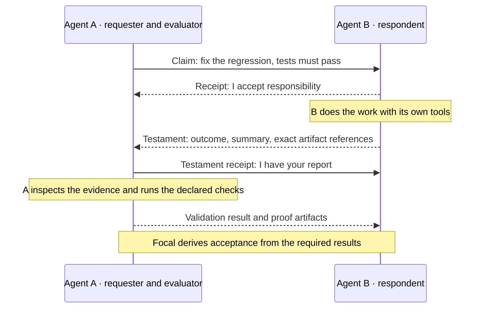

<p align="center">
  <a href="docs/assets/brand/focal-prism-preview.png">
    <picture>
      <source media="(prefers-color-scheme: dark)" srcset="docs/assets/brand/focal-prism-dark.svg">
      <source media="(prefers-color-scheme: light)" srcset="docs/assets/brand/focal-prism-light.svg">
      
    </picture>
  </a>
</p>

<h1 align="center">focal</h1>
<p align="center"><em>A ledger for agents that have to trust each other's work.</em></p>

When you hand work to a swarm of agents, you need to know what each one was asked, who took
it on, what came back, and whether it was actually checked. Focal is the ledger that answers
those questions. Your agents can:

- Ask each other for work with the acceptance criteria written down up front
- Take responsibility for a task, so you know who is on it
- Report what they did, success or failure, with the evidence attached
- Check each other's evidence and record what passed

Focal decides a task is done from those records, never from an agent saying so. It runs none
of your tools; agents use whatever they like, in any language, and Focal keeps the history.

It is one binary: the service, the command line and the MCP server.

```console
$ focal start
{ "condition": "Ready", ... }

$ focal schema example claim.submit > claim.json
$ focal submit claim --file claim.json
Committed
Claim: d4cc83c48c5ad2bafaa1802bb87c3e07

$ focal claim post d4cc83c48c5ad2bafaa1802bb87c3e07
Committed
Claim: d4cc83c48c5ad2bafaa1802bb87c3e07 (Posted)

$ focal receipt acquire d4cc83c48c5ad2bafaa1802bb87c3e07
Committed
Receipt: e2c5670ea738bf9bfd18035388f80e8f (epoch 1)
Claim: d4cc83c48c5ad2bafaa1802bb87c3e07
```

*Console output in this README was captured from a debug build at `125effd` on macOS with
`--data-dir` pointed at a scratch directory; JSON is trimmed where marked with `...`.*

Focal has no release yet. The local service, the whole claim and evidence workflow through
the CLI and MCP, restart recovery, durable retries, and joining nodes into a cluster all
work today. Automatic placement across hosts, range movement, archival and restore,
Kubernetes packaging, multi-region operation and Windows are still being built.
[docs/REMAINING.md](docs/REMAINING.md) lists each piece and what closes it.

## Install

Until the first tagged release, build from source. You need Rust 1.94.1 (pinned in the
toolchain file, so `rustup` picks it up) and a protobuf compiler (`brew install protobuf`
or `apt-get install protobuf-compiler`):

```sh
git clone https://github.com/hyper-light/focal && cd focal
bash scripts/cargo.sh build --release -p focal-node --bin focal --locked
sudo mv target/release/focal /usr/local/bin/   # or add target/release to PATH
focal --help
```

The release workflow builds one raw binary per platform (macOS arm64 and x64, Linux arm64
and x64 on glibc and static musl), smoke-tests each on its own hardware, and attaches them
with `SHA256SUMS`. When a release is published, download the file for your platform, check
its digest, `chmod +x` it and put it on your `PATH`; nothing else is needed. Windows needs
its own transport and filesystem port first.

## Quickstart

Start the service in one terminal and leave it running:

```sh
focal start
```

It creates a private data directory (`~/Library/Application Support/Focal` on macOS,
`~/.local/share/focal` on Linux), an identity, and a local Unix socket. There is no
configuration file and no network port. To keep a ledger somewhere else, pass
`--data-dir /absolute/path` to every command, including `start`. The startup record says
what durability you actually have: on a laptop, writes are synced to this disk and loss of
the disk loses the ledger.

In another terminal, make a claim from the built-in example and post it:

```console
$ focal schema example claim.submit > claim.json
$ focal submit claim --file claim.json
Committed
Claim: d4cc83c48c5ad2bafaa1802bb87c3e07

$ focal list claims
KIND	ID	STATE/HASH	DESCRIPTION
claim	d4cc83c48c5ad2bafaa1802bb87c3e07	Generated	"Deliver the checked report"
SEQUENCE	1	VISITED	1

$ focal claim post d4cc83c48c5ad2bafaa1802bb87c3e07
Committed
Claim: d4cc83c48c5ad2bafaa1802bb87c3e07 (Posted)

$ focal ledger summary
LEDGER	fdb5795f2c6d5a00871e7e521eedf9b8/4040bf729c435aa42d8e669849605d5a
SEQUENCE	1
ROUTE EPOCH	1
APPLIED INDEX	4
CLAIMS	1
TESTAMENTS	0
ARTIFACTS	0
VALIDATIONS	1
EVIDENCE SETS	0
VALIDATION RUNS	0
```

You generate a claim, then post it; only a posted claim can be picked up. The example is a
claim on yourself with one required check, that the report is received, so you can see the
mechanics without setting up a real evaluator. IDs are 32 hex characters, hashes 64. Every
read prints the `SEQUENCE` it was served at, so you always know how current it is.

Stop the service with Ctrl-C and run `focal start` again: the same ledger comes back.

### Run the whole workflow

The demo takes a claim all the way through: post, receipt, a stored test report, a
testament, its receipt by the claimant, a recorded validation, and the derived result. It
owns its directory, so give it one that no service is using:

```console
$ focal --data-dir /tmp/focal-demo demo
{ "claim": [...], "status": 8, "sequence": 13, "validation": 1,
  "artifact": { "root": [...], "length": 35, "class": 2 },
  "history": [ { "status": 1, "sequence": 4 }, ..., { "status": 8, "sequence": 13 } ] }

$ focal --data-dir /tmp/focal-demo demo      # the same claim and proof, nothing re-run
```

`status: 8` is `Satisfied` and `validation: 1` is `Pass`; `focal schema get domain-registry`
prints the vocabulary. The second run recovers rather than repeats.

To do the same by hand as two participants, the respondent side is:

```sh
focal receipt acquire CLAIM_ID
focal evidence begin --claim CLAIM_ID --receipt RECEIPT_ID --receipt-epoch 1
focal submit artifact --claim CLAIM_ID --receipt RECEIPT_ID --receipt-epoch 1 \
  --evidence-set EVIDENCE_SET_ID --kind test-report --schema-hash SCHEMA_HASH \
  --text '{"passed":1,"failed":0,"skipped":0}'
focal submit testament --claim CLAIM_ID --receipt RECEIPT_ID --receipt-epoch 1 \
  --evidence-set EVIDENCE_SET_ID --artifact ARTIFACT_ID:DESCRIPTOR_HASH \
  --summary 'Checked report attached' --confidence committed --outcome complete
```

and the claimant then receives the testament, reads the artifact, and records the
validation. Failed work is reported the same way, with an error artifact instead of a
report; a testament that says "failed" is still a testament. Every step with its flags is
in the [manual](docs/manual-cli.md#deliver-artifacts-and-a-testament).

## What two agents see



Every arrow is a record both agents can read back, and you can too. B always writes its own
report, whether the work succeeded or failed; Focal never writes one for it, so an agent that
went quiet shows up as exactly that. When you write a claim you say who checks it and with
what; the checker runs that tool itself and records the result. A claim is satisfied when its
required checks pass and the claims it depends on are done, and not before.

| Object | What it records |
|---|---|
| **Claim** | A directed request, its acceptance requirements, scope, and relations to other claims |
| **Testament** | The respondent's closing statement and the exact ordered list of artifacts |
| **Artifact** | Typed, immutable evidence: inline bytes or a stored content reference, with a descriptor hash |
| **Validation** | A declared check, its evaluator, and the recorded runs and verdicts |

On a fresh ledger these run on the V1 engine. The **native engine**, switched on per ledger
with `focal cluster replicas activate-native`, gives each of the four its own lifecycle,
treats failed work as evidence, and adds peer workflows: a **challenge** asks the
respondent for proof, a **consult** asks for work answering a question, and corrections
and follow-ups cite the exact record they respond to. A populated V1 ledger is imported
rather than rewritten.

## Use it with an AI agent (MCP)

`focal mcp serve` is a [Model Context Protocol] server over stdio. Start the service, then
point your client at the binary and the same data directory, both by absolute path:

**Claude Code**
```sh
claude mcp add focal -- /usr/local/bin/focal --data-dir /absolute/path/to/ledger mcp serve
```

**Claude Desktop, Cursor and other `mcpServers` clients**
```json
{
  "mcpServers": {
    "focal": {
      "command": "/usr/local/bin/focal",
      "args": ["--data-dir", "/absolute/path/to/ledger", "mcp", "serve"]
    }
  }
}
```

**Codex CLI**, in `~/.codex/config.toml`:
```toml
[mcp_servers.focal]
command = "/usr/local/bin/focal"
args = ["--data-dir", "/absolute/path/to/ledger", "mcp", "serve"]
```

A remote participant uses `--client-context NAME` (an enrolled QUIC connection) in place
of the data directory. The handshake against the ledger above:

```console
$ focal mcp serve
← {"jsonrpc":"2.0","id":1,"result":{"protocolVersion":"2025-11-25","capabilities":{"tools":{}},"serverInfo":{"name":"focal","version":"0.1.0"}}}
← tools/list: 16 tools on the first page, nextCursor present
```

`tools/list` is paged; follow `nextCursor` until it is gone and use the schemas you get
back. The tools are the same operations as the CLI: `claim.*`, `receipt.acquire`,
`evidence.begin`, `artifact.*`, `testament.*`, `validation.*`, `monitor.*`,
`ledger.summary`, plus `request.*` for recovering a lost reply, `upload.*` for large
payloads and `watch.*` for following changes. Each mutation carries its own durable
operation ID, so a retry after a crash resolves the original outcome instead of doing the
work twice.

Five skills teach an agent the workflow, pinned to the tool versions in
[skills/manifest.json](skills/manifest.json):

| Skill | What it covers |
|---|---|
| [focal-claims](skills/focal-claims/SKILL.md) | Author and progress claims; recover exact operations |
| [focal-evidence](skills/focal-evidence/SKILL.md) | Produce artifacts and submit testaments |
| [focal-validation](skills/focal-validation/SKILL.md) | Run external checks and record results against the pinned context |
| [focal-peers](skills/focal-peers/SKILL.md) | Challenge, consult, correct and follow up on a native ledger |
| [focal-cluster](skills/focal-cluster/SKILL.md) | Inspect and administer local cluster state |

Tool contracts, the request stream and recovery: **[docs/mcp.md](docs/mcp.md)**.

## CLI reference

| Command | What it does |
|---|---|
| `focal start` | Run the service (`--advertise HOST:PORT` to accept peers) |
| `focal submit claim \| testament \| artifact \| validation` | Author from flags, `--json`, `--yaml` or `--file` |
| `focal claim post \| progress \| cancel \| wait ID` | Progress a claim you issued |
| `focal receipt acquire ID` · `evidence begin` | Take responsibility; open an evidence set |
| `focal get claim \| testament \| artifact \| validation ID` | One object, as a table or `--format json` |
| `focal list claims \| testaments \| artifacts \| validations [filters]` | Bounded pages; every filter optional; `--all` follows pages |
| `focal ledger summary` · `ledger traverse claim:ID` | Counts; the graph around one object |
| `focal watch claims` · `monitor register` | Follow changes; durable wait predicates |
| `focal schema list \| get \| example NAME` | Contracts and examples, no service needed |
| `focal request retry --operation-id ID` · `request pending` | Resolve a lost reply |
| `focal context` | Save and select connections, local or remote |
| `focal cluster …` · `focal join` · `focal deployment explain` | Membership, enrollment, offline placement checks |
| `focal mcp serve` · `focal demo` · `focal completion SHELL` | The MCP server; the demo; shell completions |

Flags, JSON and YAML compile to the same request, so the three cannot drift. Unknown
fields and duplicate keys are rejected. Exit codes and every flag: **[docs/manual-cli.md](docs/manual-cli.md)**.

## How it works

- **Why you can trust a read.** Every change is written to a log on disk before it is
  acknowledged, then applied into memory and published all at once. What you read is a
  complete, committed state, never half of a change.
- **Why a restart changes nothing.** Recovery replays the log and runs no tools, clocks or
  validators; their results were recorded as inputs the first time. You get the same ledger
  back at the same sequence.
- **Why evidence cannot be swapped.** Artifact bytes are stored by their hash and checked
  against it before the ledger may point at them. A report says which bytes were checked, and
  those are the bytes you will find.
- **Why a lost reply is safe.** An agent records what it is about to do, under its own ID,
  before it sends it. If the reply is lost it resends the same ID and gets the original
  outcome; it cannot accidentally do the work twice.
- **Why it stays up under load.** Pages, scans, queues and request windows all have limits,
  and the service tells you when it is under pressure instead of falling over later.

The design is in [docs/archictecutre/](docs/archictecutre/README.md) (the directory name
is deliberate), starting with the [target architecture](docs/archictecutre/00-target-architecture.md).

## More than one machine

Nodes talk over one UDP/QUIC port with mutually authenticated identities. The founder
writes a one-use invitation; a second node enrolls from it and starts:

```sh
focal --data-dir ~/focal-founder start --advertise 192.0.2.10:7443
focal --data-dir ~/focal-founder cluster invite --node worker-2 --output worker-2.invite

# on the second host, after copying the invitation
focal --data-dir ~/focal-node join --invite-file worker-2.invite --advertise 192.0.2.20:7443
focal --data-dir ~/focal-node start
```

Joining lets the new node take part in the cluster; it does not yet copy your ledger onto
it or make your data survive the loss of the first machine. Today you do that yourself with
`cluster membership` and `cluster replicas`; the automatic placement that will do it for you
is the next batch of work. Two nodes on one laptop, hosts on
different machines, and the administration commands are in
[docs/network-startup.md](docs/network-startup.md) and [docs/cluster-admin.md](docs/cluster-admin.md).

## Documentation

| Doc | What's in it |
|---|---|
| [Manual CLI](docs/manual-cli.md) | Every command with examples, input formats, filters, exit codes, recovery |
| [MCP and skills](docs/mcp.md) | Connecting a client, the tool catalogue, the request stream, skill packaging |
| [Network startup](docs/network-startup.md) · [Cluster administration](docs/cluster-admin.md) | Founder, invitations, joining, membership, diagnostics |
| [Monitors](docs/monitors.md) | Durable wait predicates under a claim |
| [Building](docs/building.md) | Toolchain, checks, the release lane |
| [Architecture](docs/archictecutre/README.md) | Design documents 00–24 |
| [Remaining work](docs/REMAINING.md) · [Implementation status](docs/archictecutre/09-implementation-status.md) | What is left, and the dated evidence for what is done |

## Contributing / development

```sh
bash scripts/cargo.sh build -p focal-node --bin focal --locked
bash scripts/cargo.sh test --workspace --all-targets --locked -- --test-threads=4
bash scripts/cargo.sh clippy --workspace --all-targets --locked -- -D warnings
bash scripts/check-production.sh        # no panics in non-test code
python3 scripts/check-contracts.py      # architecture links, imported hashes, frozen vocabularies
```

`scripts/cargo.sh` sets up the protobuf build environment and forwards to `cargo`. The
rules that hold throughout are in [docs/REMAINING.md §2](docs/REMAINING.md#2-requirements-that-must-not-be-redesigned-away):
no production panics, owned state over shared ownership, frozen history, independent
lifecycles, and participant-owned execution.

## Acknowledgements

Focal's domain model and distribution design descend from the [hecate] specifications and
the [sylk] implementation, both kept under
[docs/archictecutre/reference](docs/archictecutre/reference/README.md). Failure detection
follows SWIM with the Lifeguard extensions and Vivaldi coordinates.

## License

MIT — © 2026 Hyperlight. See [LICENSE](LICENSE).

[Model Context Protocol]: https://modelcontextprotocol.io
[hecate]: https://github.com/hyper-light/hecate
[sylk]: https://github.com/hyper-light/sylk
