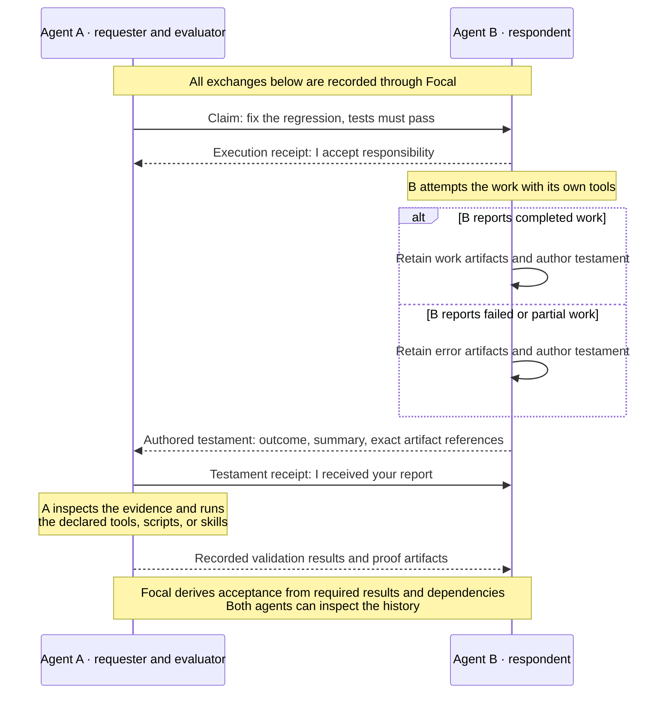
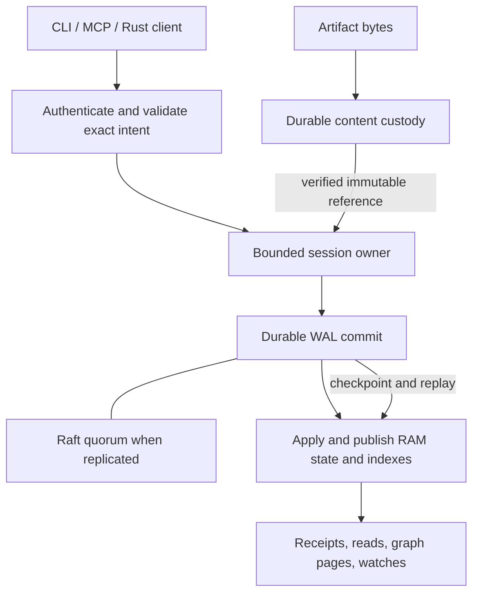

<p align="center">
  <a href="docs/assets/brand/focal-prism-preview.png">
    <picture>
      <source media="(prefers-color-scheme: dark)" srcset="docs/assets/brand/focal-prism-dark.svg">
      <source media="(prefers-color-scheme: light)" srcset="docs/assets/brand/focal-prism-light.svg">
      
    </picture>
  </a>
</p>

<h1 align="center">focal</h1>

**An inter-agent communication protocol and event-driven ledger for coordinating agent swarms: who asked, who accepted, what was delivered, which bytes were checked, and what actually passed.**

[Install](#install) · [Quickstart](#quickstart) · [Status](#status) ·
[Objects](#claims-testaments-artifacts-and-validations) · [CLI](#use-the-cli) ·
[CLI reference](#cli-reference) · [MCP](#use-it-with-an-ai-agent-mcp) ·
[How it works](#how-it-works) · [Distributed operation](#distributed-operation) ·
[What works today](#what-works-today-and-what-does-not) · [Docs](#documentation)

Focal is a durable ledger that agents and people coordinate through. Participants
exchange directed **claims**, respond with **testaments**, supply **artifacts** as
evidence, and record **validations** against that exact evidence. The ledger keeps the
ordered history and derives acceptance from the declared requirements and dependencies;
it never decides that work succeeded because someone said so. Agents run their own tools,
skills, scripts, and frameworks in any language. Focal launches nothing: it records
authorized facts and checks them.

It is one binary, written in Rust. The same `focal` executable is the service, the human
CLI, and the stdio MCP server, and the same engine runs on a laptop and across a fleet.
Working state lives in RAM; every acknowledged write is on disk first; replicated groups
agree through Raft.

Here is a session on the machine this was written on:

```console
$ focal start
{ "condition": "Ready", "durability": { "max_failures": 0, "survive": "node" },
  "meaning": "Acknowledged writes are synced to this disk; loss of this disk can lose the ledger.",
  "socket": "/tmp/focal-readme/focal.sock", ... }

$ focal schema example claim.submit > claim.json
$ focal submit claim --file claim.json
Committed
Claim: 51a9deff531f9adbff654f14104769e4

$ focal claim post 51a9deff531f9adbff654f14104769e4
Committed
Claim: 51a9deff531f9adbff654f14104769e4 (Posted)

$ focal ledger traverse claim:51a9deff531f9adbff654f14104769e4
KIND	ID	STATE/HASH	DESCRIPTION
claim	51a9deff531f9adbff654f14104769e4	Posted	"Deliver the checked report"
validation	7292ad18c09984c46c0c7559b076a546	Receipt/Required	"Receive the report testament"
SEQUENCE	2	STOP	Complete	VISITED	9	TOTAL_VISITS	9
```

*Every console block in this README was captured on 2026-09-09 from a debug build of this
checkout (the Rust tree at commit `689842a`) on an Apple M5 Max running macOS 26.4.1, with
`--data-dir` pointed at a scratch directory under `/tmp`. JSON records are abridged to the
fields discussed and ledger identifiers are shortened with `...`; nothing else is edited.*

## Status

Focal has no tagged release yet, and this README separates what runs from what is
designed. As of 2026-09-09:

- **Runs today.** One executable that is the durable local service, the CLI and the
  stdio MCP server, with restart recovery of the same ledger. The complete claim,
  receipt, artifact, testament and validation workflow through both CLI and MCP, on a
  V1 ledger and on the opt-in native engine (independent lifecycles, failed work as
  evidence, peer challenge, consult, correction and follow-up). Durable request recovery
  after a lost reply or a kill. Durable watches and monitors. Authenticated networking:
  a founder, one-use invitations, joining a second node over QUIC, root and application
  membership administration, leader transfer, credential renewal and revocation. A
  placement directory, agent, controller, admission envelope and SWIM liveness that
  expand a laptop session to three hosts and heal a lost one in the test suite.
- **Does not run yet.** Operator commands that apply a placement (`deployment plan`,
  `deployment apply`, `cluster plan`); range split, merge and movement in the live
  session; parallel apply and sharding beyond one node; archival, retention floors and
  restore; Kubernetes packaging; multi-zone and multi-region qualification; Windows; a
  published binary; a measured performance envelope.

The full list, with the acceptance criterion that closes each item, is
[docs/REMAINING.md](docs/REMAINING.md). [What works today](#what-works-today-and-what-does-not)
below is the per-area version.

## Install

There is one executable, `focal`, and it is the server, the client and the MCP server.
Running it needs no Rust toolchain, protobuf compiler, Python or source checkout.

### Prebuilt binary

The [release workflow](.github/workflows/release.yml) builds one raw binary per platform,
each on its native processor, runs the server, CLI, crash-recovery and MCP smoke checks on
it, and attaches the set with `SHA256SUMS` to a [release](https://github.com/hyper-light/focal/releases).
**No tagged release has been published yet**, so this lane is a build check today; when it
publishes, the asset names below are the stable interface.

| Platform | Asset | Runtime baseline |
|---|---|---|
| macOS, Apple silicon | `focal-macos-arm64` | macOS 15 or later |
| macOS, Intel | `focal-macos-x64` | macOS 15 or later |
| Linux x86_64 (glibc) | `focal-linux-x64` | glibc 2.39 or later (Ubuntu 24.04) |
| Linux ARM64 (glibc) | `focal-linux-arm64` | glibc 2.39 or later (Ubuntu 24.04) |
| Linux x86_64 (static musl) | `focal-linux-x64-musl` | any Linux; statically linked |
| Linux ARM64 (static musl) | `focal-linux-arm64-musl` | any Linux; statically linked |

```sh
# macOS (Apple silicon); substitute your platform's asset name
shasum -a 256 focal-macos-arm64        # compare with the entry in SHA256SUMS (sha256sum on Linux)
mkdir -p "$HOME/.local/bin"
install -m 755 focal-macos-arm64 "$HOME/.local/bin/focal"
export PATH="$HOME/.local/bin:$PATH"   # add to your shell profile to keep it
focal --version
```

Windows is an outstanding port, not a skipped lane: the Unix-socket transport, private
file checks and directory durability need their native implementation first. macOS
binaries are not yet signed or notarized.

### From source (Rust 1.94.1)

The toolchain is pinned in `rust-toolchain.toml`; `rustup` picks it up on the first
`cargo` invocation. A native protobuf compiler is needed (`brew install protobuf`,
`apt-get install protobuf-compiler`).

```sh
git clone https://github.com/hyper-light/focal && cd focal
bash scripts/cargo.sh build --release -p focal-node --bin focal --locked
install -m 755 target/release/focal "$HOME/.local/bin/focal"
focal --help
```

More detail (prerequisites, checks, the release scripts): **[docs/building.md](docs/building.md)**.

## Quickstart

Start the service in one terminal and leave it running:

```sh
focal start
```

The service creates a private durable data directory, an identity and an authenticated
local Unix socket. The default directory is `~/Library/Application Support/Focal` on macOS
and `$XDG_DATA_HOME/focal` or `~/.local/share/focal` on Linux. No configuration file and
no network port are needed. To use another directory, pass `--data-dir /absolute/path` to
**every** command, including `start`. Its startup record states the durability actually
in force: on a laptop that is `survive: node, max_failures: 0`, with the meaning spelled
out.

In another terminal, author a claim from the generated example and post it:

```console
$ focal schema example claim.submit > claim.json
$ focal submit claim --file claim.json
Committed
Claim: 51a9deff531f9adbff654f14104769e4

$ focal claim post 51a9deff531f9adbff654f14104769e4
Committed
Claim: 51a9deff531f9adbff654f14104769e4 (Posted)

$ focal list claims --source self --status posted
KIND	ID	STATE/HASH	DESCRIPTION
claim	51a9deff531f9adbff654f14104769e4	Posted	"Deliver the checked report"
SEQUENCE	2	VISITED	1

$ focal ledger summary
LEDGER	600d14cc5bcc699aba30b3889c9677e8/f05ac4f56a49b882bb679c963b740ac1
SEQUENCE	2
ROUTE EPOCH	1
APPLIED INDEX	6
CLAIMS	1
TESTAMENTS	0
ARTIFACTS	0
VALIDATIONS	1
EVIDENCE SETS	0
VALIDATION RUNS	0

$ focal claim wait 51a9deff531f9adbff654f14104769e4 --until satisfied --timeout-ms 1000
Pending 51a9deff531f9adbff654f14104769e4 Posted at sequence 2 (released: false)
focal: [wait_pending] claim wait ended Pending; latest observed state was written to stdout
$ echo $?
6
```

A few things to notice. Generating a claim and posting it are separate commits; only a
posted claim is actionable. The example is a self-targeted **handoff** with one required
**receipt** check, so it exercises delivery, not quality: nobody has acquired its receipt
yet, which is why the wait ends `Pending` with exit code 6 (busy or incomplete, never a
guess). `--target` names a participant, not a URL or a process; `self` is the
authenticated participant. IDs are 32 hexadecimal characters and hashes are 64. Every
read prints the `SEQUENCE` it was served at, because reads expose one complete published
prefix and never a mix.

Stop the service with Ctrl-C and run `focal start` again: the same ledger comes back at
the same sequence (the summary above reads `APPLIED INDEX 7` after the restart and is
otherwise identical). Local acknowledgment means the write was synced to this disk; a
single-node service cannot survive the loss of that disk, and says so at startup.

### Try the complete evidence workflow

The resumable demo runs the whole cycle against a directory it owns exclusively: a work
claim, its receipt, a durably stored test report, a closed and received testament, a
recorded validation, and derived satisfaction.

```sh
focal --data-dir /tmp/focal-demo demo
focal --data-dir /tmp/focal-demo demo      # recovers the same claim and proof; reruns nothing
```

The JSON report encodes the claim's `Satisfied` status as `status: 8` and its `Pass`
verdict as `validation: 1`, with the history and the stored content reference;
`focal schema get domain-registry` explains the frozen vocabulary codes. The demo
invokes a built-in validator through the Rust embedding API, so use a directory separate
from a running service. The participant-driven version of the same steps is
[deliver artifacts and a testament](docs/manual-cli.md#deliver-artifacts-and-a-testament).

The record answers a different question at each stage: the claim records what was
requested; the receipt records who accepted responsibility; the testament records what
that participant says it delivered; the validation records which checks actually passed.
A successful upload or a confident closing statement alone never establishes that the
request was satisfied.

### Switch a ledger to the native engine

A fresh ledger runs the V1 engine. The **native engine** is the corrected model in which
claims, testaments, artifacts and validations each have their own lifecycle and
authority, failed work is reported as diagnostic evidence, and peer challenge and consult
workflows exist. It is activated per ledger, offline on a laptop:

```console
$ focal --data-dir /tmp/focal-native cluster replicas activate-native
{ "activated": true, "proposed": true,
  "result": { "kind": "replica_native_activation_proposed", "session": "45e6...", "group": "45e6..." } }

$ focal --data-dir /tmp/focal-native start &
$ focal --data-dir /tmp/focal-native submit claim --target self --action handoff \
    --description 'Deliver the checked report' \
    --validation-json '{"kind":"receipt","description":"Receive the report testament","deadline":{"at":4102444800000}}'
CONDITION	Committed
OPERATION_ID	n1:180c1069fcd77acb5955a1ad201b19fd
SEQUENCE	1
OPERATION	create
CREATED	claim	f777cee7bbf13baed7dc6798578d7216
CREATED	validation	a1c58142ed688f462a31d7ff971d9805
```

The same verbs answer on both engines; the CLI probes the engine once per invocation. On
a native ledger every document compiles to one exact frame, is journaled under an `n1:`
operation ID before it is sent, and is resent byte for byte until the owner commits or
refuses it. A populated V1 ledger is imported deterministically rather than rewritten. On
a networked group, activation commits only after every voter has promised the native
decoder. The contracts are [16](docs/archictecutre/16-peer-validation-contract.md),
[17](docs/archictecutre/17-lifecycle-state-and-authority.md) and
[23](docs/archictecutre/23-native-activation-and-import.md).

## Claims, testaments, artifacts, and validations

| Object | What it records | What to inspect |
|---|---|---|
| **Claim** | A directed request, immutable acceptance requirements, scope, and relationships to other claims | Issuer, subject, current status, dependencies, and history |
| **Testament** | A respondent's closing statement and the exact ordered manifest of delivered artifacts | Summary, outcome, confidence, artifact IDs plus descriptor hashes |
| **Artifact** | Immutable typed evidence with provenance and inline bytes or a durable content reference | Producer, schema, inputs, descriptor hash, payload |
| **Validation** | A declared check and its recorded evaluation runs and verdict attempts | Designated evaluator, pinned handler and version, exact target, result, proof artifacts |

The **issuer** authors the request and acceptance contract. The **subject** is the
participant asked to respond; its execution receipt identifies the current authorized
holder and generation. The **evaluator** is the participant designated to check the
evidence. One participant may fill several permitted roles, but reading a claim or
enrolling a physical node grants no evaluation authority.

### How two agents coordinate

Agent A asks Agent B for a regression fix and, in this example, is also the designated
evaluator. Each agent runs its own tools; Focal records their exchanges and publishes the
resulting events to both.



**Agent B always authors a testament when its work completes or fails.** Failures,
errors, refusals, interruptions and partial work are reported with error artifacts.
Focal never creates a testament on B's behalf: the receipt records responsibility, the
testament records B's own account. A completion statement is still subject to the declared
validation requirements, and satisfaction is derived from those results plus the claim's
dependencies.

A validator definition names the evaluator, check kind, phase, required or observe mode,
pinned handler identity and version, and accepted evidence schemas. An agentic handler
and a programmatic handler share one evidence and result contract. The participant maps
that reference to its own implementation and invokes it; Focal does not load scripts from
a claim or assume a language or agent runtime. Receiving a testament proves delivery; a
passing required check supplies an acceptance witness; an observational check is recorded
without blocking completion. [Peer validation](docs/archictecutre/16-peer-validation-contract.md)
is the contract.

### Independent lifecycles

Accepting responsibility, delivering evidence and establishing satisfaction are distinct
events with their own histories. Submitting a testament runs no validator and establishes
no success. A claim can meet its local requirements and still wait for a dependency.
Cancellation, expiry and failed checks have their own guarded terminal outcomes, and a
terminal claim is never repainted by a late result: corrections get new identities and
explicit lineage.

On the native engine all four families have their own coordinated state machines: an
artifact can exist before its testament closes; receiving that testament makes its exact
evidence eligible for whole-work checks without marking the artifact validated; result
artifacts and the issuer's final audit testament have separate terminal roles and cannot
rewrite a response's frozen manifest. A **challenge** asks the respondent for proof
addressing the challenger's claim and carries an immutable follow-up policy (who may
correct it, how many follow-ups, one issuer or several); a failed challenge is terminal,
and a **correction** cites the exact report of that verdict. A **consult** asks for work
answering a query and may be refined by bounded **follow-ups**. Every one of these is an
authored shape of `claim.submit`: same frame, same identity, same receipt, so there is no
second workflow engine. The V1 engine keeps one closing testament per claim and narrower
artifact and testament state. [17](docs/archictecutre/17-lifecycle-state-and-authority.md)
fixes the transitions and writers.

## Use the CLI

Choose field flags, JSON, YAML or a file. These three **alternative** commands author the
same claim; running all three creates three claims:

```sh
focal submit claim --target self --action handoff \
  --description 'Deliver the checked report' \
  --validation-json '{"kind":"receipt","phase":"whole_work","mode":"required","description":"Receive the report testament","evaluator":"self"}'

focal submit claim --json '{"target":"self","action":"handoff","description":"Deliver the checked report","validations":[{"kind":"receipt","phase":"whole_work","mode":"required","description":"Receive the report testament","evaluator":"self"}]}'

focal submit claim --yaml 'target: self
action: handoff
description: Deliver the checked report
validations:
  - kind: receipt
    phase: whole_work
    mode: required
    description: Receive the report testament
    evaluator: self'
```

Use `--file claim.yaml` or `--file - --input-format json` for documents and stdin. One
shared Rust builder converts authored input to the wire request, so flags, JSON and YAML
cannot drift apart. Unknown fields, duplicate keys and mixed document-plus-field input fail
explicitly. `--format json` and `--format yaml` select structured output; the default is
for reading. `--help` works at every level and `focal schema` answers contract questions
without a running service:

```sh
# Exact objects and recorded evaluation results
focal get claim CLAIM_ID
focal get claim --source PARTICIPANT_ID --target PARTICIPANT_ID     # must match exactly one
focal get artifact ARTIFACT_ID --output ./report.json
focal get validation VALIDATION_ID --context --format json

# Every list filter is optional
focal list claims
focal list artifacts --testament TESTAMENT_ID
focal list claims --source self --status posted --all --format json  # one page per line

# Observe and explore
focal claim wait CLAIM_ID --until satisfied --timeout-ms 30000
focal watch claims --name my-claims
focal ledger traverse claim:CLAIM_ID
focal validator list --claim CLAIM_ID

# Discover input contracts instead of guessing fields
focal schema list
focal schema get testament.submit
focal schema example testament.submit
focal schema coverage                       # every native operation, its actor, tool name and CLI path
focal completion zsh > _focal               # bash, elvish, fish, powershell, zsh
```

A filtered singular `get` proves there is exactly one match; ambiguity is an error. Lists
serve bounded pages at one fixed committed prefix, and `--all` follows those pages without
mixing versions. Watches keep their delivery position locally and resume after an
interruption. Artifact downloads publish a complete new file and never overwrite.

**Uploads.** `submit artifact --payload-file FILE` and `artifact register --payload-file FILE`
stage the bytes before sending, so recovery does not depend on the source file staying
put; `artifact upload inspect UPLOAD_ID` and `artifact upload cancel UPLOAD_ID` manage the
retained transfer.

**Recovery.** Every mutation saves a durable operation identity before it is transmitted.
If a reply is lost, the printed `focal request retry --operation-id m1:...` (or `n1:...` on
a native ledger) resolves the same intent; `focal request pending` lists what still needs
an answer. Starting a new submit creates a new intent and never resolves the old unknown
outcome.

**Contexts.** `focal context` saves named connections: the local Unix socket, or an
authenticated remote QUIC client enrolled from an invitation (`context enroll NAME
--invite-file FILE`). `--client-context NAME` selects one for a command and
`context use NAME` sets the default.

The **[manual CLI guide](docs/manual-cli.md)** has the complete evidence and validation
commands, filter matrices, output and exit-code contracts, streaming, contexts and exact
recovery.

## CLI reference

| Command | What it does |
|---|---|
| `focal start [--advertise HOST:PORT] [--listen ADDR]` | Run the durable service; with `--advertise`, also the authenticated QUIC listener and the local admin socket |
| `focal status` · `identity` · `ledger summary` · `ledger traverse KIND:ID` | The published prefix, the saved identity, bounded counts, and bounded graph pages at one prefix |
| `focal schema list` · `get NAME [--native]` · `example NAME` · `validate` · `coverage` | Contracts, examples and local validation, with no service running |
| `focal submit claim` · `claims` · `testament` · `artifact` · `validation` | Author work or evidence from flags, JSON, YAML or a file |
| `focal claim post` · `progress` · `cancel` · `supersede` · `wait` | Progress a claim you issued; `wait` observes for at most 30 s |
| `focal claim challenge` · `consult` · `correct` · `follow-up` · `lineage` · `release-scope` | Peer workflows on a native ledger |
| `focal receipt acquire` · `adopt` | Accept responsibility as the subject; as the issuer, replace the holder |
| `focal evidence begin` · `artifact submit` · `diagnostic` · `fail` · `register` | The respondent's evidence set and slots; `register` is evidence under your own name |
| `focal testament submit` · `post` · `receive` | Close a work cycle; post it to the issuer; record its receipt as the issuer |
| `focal artifact receive` · `reject` | As the issuer, accept or reject one work artifact with your diagnostic |
| `focal validation begin` · `begin-increment` · `report` · `complete` · `seal-increments` · `enter-whole-work` | Record evaluation lifecycle facts; the tools run outside Focal |
| `focal audit generate` · `post` | The issuer's result testament for a closed claim (native) |
| `focal get claim` · `testament` · `artifact [--output FILE]` · `validation [--context]` | One exact object, or one proven-unique filtered match |
| `focal list claims` · `testaments` · `artifacts` · `validations` · `evaluations` · `receipts` · `monitors` · `events` | Bounded pages; every filter optional; `--all` streams pages |
| `focal validator list` · `get` | Pinned external handler contracts recorded by claims |
| `focal monitor register` · `get` · `rebind` · `cancel` | Durable owner-authorized wait predicates |
| `focal watch claims` · `testaments` · `artifacts` · `validations` · `all` · `resume` · `inspect` | Follow committed changes; acknowledge only flushed output |
| `focal request pending` · `inspect` · `retry` · `status` · `seal` · `acknowledge` · `build` · `check` · `send` | Exact recovery of saved operations and raw wire envelopes |
| `focal artifact upload inspect` · `cancel` | Retained payload transfers |
| `focal context add` · `enroll` · `use` · `list` · `show` · `remove` | Named local or authenticated remote connections |
| `focal join --invite-file F --advertise HOST:PORT` | Enroll this host into a cluster from a private invitation, then exit |
| `focal cluster status` · `nodes` · `membership` · `leader` · `invite` · `client invite` · `invitations` · `credentials` · `node` · `replicas` · `request` | Inspect and administer the local node over its admin socket |
| `focal deployment explain --inventory F` · `schema` | Check a desired guarantee offline against verified node facts |
| `focal mcp serve` | Serve the MCP tools over stdio |
| `focal demo` · `completion SHELL` | The resumable example; shell completions from the real command tree |

Exit codes: 0 done (a recorded *failing* validation is still a successful submission);
1 local I/O or transport; 2 invalid input or configuration; 3 unauthenticated or
unauthorized; 4 not found; 5 ambiguous selection, conflicting fence or retired identity;
6 busy, capacity or an incomplete bounded wait; 7 **unknown mutation outcome, recover the
saved operation**; 8 expired read snapshot; 9 an offline placement cannot satisfy the
requested guarantee; 130 interrupted. Under `--format json` the final diagnostic on stderr
is a JSON object with `error.code` and `error.exit_code`. The full grammar:
**[docs/manual-cli.md](docs/manual-cli.md)**.

## Use it with an AI agent (MCP)

`focal mcp serve` is a [Model Context Protocol] server over stdio (revision 2026-07-28,
with the 2025-11-25 `initialize` profile for older clients). It is a thin dispatch over
the same Rust client the CLI uses, so an agent drives the same authenticated operations,
receives the same typed refusals and recovers through the same durable journals a person
does. The adapter is a separate foreground process: stdout carries JSON-RPC, stderr
carries diagnostics, and the service keeps owning the ledger.

Start the service, then point a client at the binary by absolute path, with the same
`--data-dir` (or a named client context), because MCP clients launch servers with no
working directory and often no `PATH`:

**Claude Code**
```sh
claude mcp add focal -- /absolute/path/to/focal --data-dir /absolute/path/to/ledger mcp serve
```

**Claude Desktop, Cursor, and other `mcpServers` clients**
```json
{
  "mcpServers": {
    "focal": {
      "command": "/absolute/path/to/focal",
      "args": ["--data-dir", "/absolute/path/to/ledger", "mcp", "serve"]
    }
  }
}
```

**Codex CLI**, in `~/.codex/config.toml`:
```toml
[mcp_servers.focal]
command = "/absolute/path/to/focal"
args = ["--data-dir", "/absolute/path/to/ledger", "mcp", "serve"]
```

A remote participant uses `--client-context NAME` instead of `--data-dir`, selecting an
enrolled QUIC connection. A captured handshake against the quickstart ledger:

```console
$ focal --data-dir /tmp/focal-readme mcp serve
← {"jsonrpc":"2.0","id":1,"result":{"protocolVersion":"2025-11-25","capabilities":{"tools":{}},"serverInfo":{"name":"focal","version":"0.1.0"}}}
← tools/list: 49 tools over 4 pages
```

`tools/list` is paginated: follow `nextCursor` until it is absent, and discover the
schemas rather than generating fields from a tool's name. On a V1 ledger the catalogue
is the application operations (`claim.*`, `receipt.acquire`, `evidence.begin`,
`artifact.*`, `testament.*`, `validation.*`, `validator.*`, `monitor.*`, `ledger.summary`,
`ledger.traverse`), six `request.*` recovery tools, five `upload.*`/`artifact.download`
transfer tools and four `watch.*` tools. On a native ledger the adapter probes the engine
once and serves the version-2 catalogue instead: 51 tools, adding `claim.challenge`,
`claim.consult`, `claim.correct`, `claim.follow_up`, `claim.lineage`, `artifact.diagnostic`,
`artifact.fail`, `artifact.receive`, `artifact.reject`, `testament.post`,
`validation.report`, `validation.seal_increments`, `validation.enter_whole_work`,
`receipt.adopt`, `audit.*`, `ledger.standing`, `event.list`, `evaluation.list` and
`receipt.list`. A local operator additionally sees 33 `cluster.*` tools when the node has
its admin socket. A tool the adapter did not list is refused when called.

Every authored mutation carries its own durable operation ID (`m1:` reserved first on
V1, `n1:` returned on native); a JSON-RPC request ID alone does not protect a retry across
a restart. Results must be acknowledged (`request.acknowledge`) so the bounded journal can
advance; an unconsumed window reports pressure instead of growing. Transfers, watches and
administration have their own identities and recovery contracts.

Five packaged instruction skills teach the workflow, each pinned to the exact tool
versions in [skills/manifest.json](skills/manifest.json):

| Skill | Purpose |
|---|---|
| [focal-claims](skills/focal-claims/SKILL.md) | Author and progress claims, inspect dependencies, recover exact operations |
| [focal-evidence](skills/focal-evidence/SKILL.md) | Produce artifacts, preserve immutable manifests, submit and post testaments |
| [focal-validation](skills/focal-validation/SKILL.md) | Invoke external checks and record results against the pinned evaluation context |
| [focal-peers](skills/focal-peers/SKILL.md) | Challenge, consult, correct and follow up on a native ledger; read lineage |
| [focal-cluster](skills/focal-cluster/SKILL.md) | Inspect and administer authorized local cluster state |

Register each `SKILL.md` with your agent host and keep the `skills/` directory together;
the relative links are intentional. The full tool contracts, the managed request stream,
transfer and watch recovery and the native catalogue: **[docs/mcp.md](docs/mcp.md)**.

## How it works



- **The log owns order; RAM owns reads.** A session has one total order. Its leader admits
  each mutation against committed state plus the ordered pending overlay, appends it to a
  node-local write-ahead log, and acknowledges only after the required durable flush (one
  voter on a laptop) or a Raft quorum whose entries are on disk (replication into another
  process's memory does not count). A deterministic reducer applies the committed prefix
  into custom RAM storage and publishes it atomically; reads see a complete prefix and
  never a half-applied mutation.
- **Recovery executes nothing.** State, terminal results and deltas are functions of the
  committed log prefix. Validators, clocks, randomness and subprocesses never run during
  replay; their outcomes and deadline firings were logged as inputs. Checkpoints shorten
  replay; they never change its meaning.
- **Evidence is its own durability condition.** Artifact bytes live in content-addressed
  custody, verified against their descriptor hash before the ledger may reference them.
  Adding a log voter does not copy artifact bytes, and the placement directory tracks
  custody separately.
- **Retries are exact.** Every client mutation is journaled under a durable operation
  identity with its revision fence before it is sent. A timeout is an unknown outcome,
  never proof of non-commit; the same identity is resent, or its receipt is queried. The
  same discipline covers administration (`a1:`, `r1:`), uploads and watches.
- **Everything is bounded.** Pages, scans, queues, completion buffers, request windows and
  disk writes have explicit budgets, and admission reports pressure instead of
  accumulating work. Production Rust has a no-panic policy and avoids shared ownership
  unless a concurrency reason is written down.

The design is in [docs/archictecutre/](docs/archictecutre/README.md): the target
architecture and its fifteen invariants ([00](docs/archictecutre/00-target-architecture.md)),
storage and distribution ([04](docs/archictecutre/04-storage-and-distribution.md)),
the ownership and failure policy ([10](docs/archictecutre/10-ownership-and-failure-policy.md)),
and the native formats ([21](docs/archictecutre/21-native-input-format.md),
[22](docs/archictecutre/22-native-record-format.md)). The directory name is deliberate.

## Distributed operation

Focal is designed to run the same engine on one laptop and across a fleet, and to treat
every step between them as a **placement of that engine, not a mode**. The operator
supplies the facts Focal cannot derive: which failures to survive, where data may live,
who may join, and what resources to spend. Focal derives voter counts, placement, apply
partitions and log streams, and prints the guarantee actually in force. Nobody chooses a
shard count, a Raft term, a routing epoch or a range split key to set up a cluster.

### Platforms

| Platform | Service, CLI, MCP | Notes |
|---|---|---|
| macOS 15+ (Apple silicon, Intel) | yes | The platform the captured sessions ran on; release lane builds and smoke-tests natively |
| Linux glibc 2.39+ (x86_64, ARM64) | yes | Release lane on Ubuntu 24.04; the 2,441-test workspace run is recorded on macOS only |
| Linux static musl (x86_64, ARM64) | yes | Statically linked; runs in the pinned Rust Alpine image and on Ubuntu |
| Windows (MSVC) | not yet | The Unix-socket transport, peer credentials, private files and directory durability need their native port |
| Kubernetes | planned | Packaging only; manifests derive scheduling constraints from the chosen policy, and no Kubernetes-specific durability flag will exist |

Nodes talk to each other over one UDP/QUIC port with mutually authenticated X.509
identities; clients and operators reach their local node over a private Unix socket that
the operating-system owner authenticates.

### Replication

Every durable decision is a Raft log entry in one of two kinds of group. The **root
metadata group** holds membership, node contacts, invitations, credentials and directory
delegation. Each **application session** has its own group holding the ledger. A write is
acknowledged when the quorum's required entries are fsynced; on a laptop that quorum is
the one local voter, and the startup record says exactly that. Membership changes use
joint consensus: a node joins as a **learner**, is promoted to voter only after actual
catch-up, and leaves through an explicit joint-configuration exit. Application replicas
have their own membership under configuration fences, and changing root membership does
not install an application replica.

The write-ahead log is node-local and multiplexed: many logical Raft logs share a bounded
number of physical writers and preallocated segments with a generation and checksum chain,
so recycled bytes can never validate as current records. Evidence custody is tracked
separately from the log: the directory records a `Custody` fact per copy, and a copy
reaches `CustodyVerified` before it may be promoted.

### Placement

The **directory** (partitioned, replicated through its own control group) holds the
desired placement of every session and one `AssignmentProgress` row per copy, climbing
`Assigned → Installed → CaughtUp → CustodyVerified → Promoted`. A plan's cutover fence is
accepted only when every voter is promoted; activation leaves the abandoned copies in a
`retiring` map to be drained and retired; a refusal is a typed, bounded record; and
`effective_guarantee` reports what the live fleet actually provides, not what was asked.
A **placement agent** on every node registers its sessions, reports memory, replica and
disk load, installs assigned copies and signs its own readiness. A **placement
controller** on the leading node drives plans to activation, drains and retires, and
re-plans under the active policy when the live registry no longer satisfies it. In the
test suite a laptop session expands to three hosts unattended, tolerates the loss of one
and takes it back when it returns. Admission gives every durable write (WAL batches,
checkpoints, upload staging, sealed objects, imports) its bytes from one **disk envelope**
per volume before any acknowledgment, and admits a tenant to a node only when a committed
placement assigns it a session. The operator commands that expose this (`cluster plan`,
`deployment plan`, `deployment apply`) are the next batch; today `deployment explain`
checks a guarantee offline and the controller runs under the test harness.

### Sharding

Scale comes from **independent sessions**, not a bigger log. Each session has one total
order; different sessions have no relative order, and fleet growth creates more bounded
session and metadata groups rather than a global log or an all-session scan. Within a
session, graph objects and indexes are range-partitioned and applied by a deterministic
parallel scheduler that is an optimization of the serial reducer, gated by differential
tests against it. Conflicting keys stay serial; replicas do not raise write throughput for
one hot key, and Focal says so rather than promising linear scaling.

Range split, move and merge are session-log decisions: commit the intent with its new
routing epoch, transfer a hash-verified seed prefix, catch the destination up, gate
admission and commit a cutover barrier, activate the new epoch, update the directory by an
idempotent compare-and-swap, answer stale epochs with `NotOwner{current_epoch}`, and retire
the old copy only after read pins and watches drain. No step needs the failed source's
memory; every step has a stable operation ID and resumes after coordinator death. The
range crate and its fenced transfers exist as groundwork; connecting them to live node
writes, recovery and transport is R7 in [docs/REMAINING.md](docs/REMAINING.md).

### Failover and liveness

Leadership follows Raft: survivors elect, speculative effects are discarded and rebuilt
from committed state, and a client whose reply was lost resends the same durable identity.
A minority never force-promotes. Each session placement declares what it promises to
survive:

| Placement contract | Acknowledgement | When a region is lost |
|---|---|---|
| Laptop, one voter | Local durable append | Restart recovers on intact storage; loss of the only disk is outside the guarantee |
| Regional fault tolerance | Durable voter majority across the configured node or zone failures | The region can be unavailable; no zero-loss automatic promotion outside its quorum |
| Synchronous multi-region | Durable quorum spread so surviving regions keep a majority | Surviving majority elects and serves; cross-region RTT is in the write path |
| Disaster-recovery copy | Primary contract plus an explicitly lagging archive | Restore to a known prefix with a reported recovery point, never sold as zero-loss failover |

Three voters in three regions survive any one region; five placed 2/2/1 survive either
two-voter region; three placed 2/1 do not survive loss of the larger side, and the planner
refuses to call that regional survival. Region placement, residency and home-region
eligibility are data in the deployment schema (`survive`, `max_failures`, `home_regions`,
`residency`); the geographic executor is R9.

Failure detection is a **SWIM** membership protocol with the Lifeguard extensions. Every
node probes a shuffled round of confirmed peers, falls back to indirect probes through up
to three other members, and only then starts a suspicion whose deadline shortens as
independent confirmations arrive. A node's own *local health* (its missed probes, late
ticks and refuted self-suspicions) multiplies every timeout it applies, so a slow node
accuses nobody hastily; a loaded node can ask for bounded, decaying deadline extensions
witnessed by its own progress; and **Vivaldi** network coordinates, carried on every probe,
bound each peer's timeout by the estimated round trip. Settled verdicts are committed by
the partition leader as directory facts the planner, the healer and the guarantee report
consume. A restarted host revives at a higher incarnation without re-enrolling.

Credentials are client-owned keys under constrained X.509. A node renews its certificate
ten days before expiry, or on `cluster credentials renew`, under the same key, and
presents it on its listener, peer pool and placement agent at once; the old certificate
retires after the sponsor's grace. Revocation runs through the issuing invitation and does
not by itself remove consensus membership or drain placement.

### Two nodes on one host

The founder advertises an endpoint, writes a private one-use invitation, and the second
node enrolls from it. The invitation pins the cluster, the founder's endpoint and the
trust material; no seed list or copied certificate is needed.

```console
$ focal --data-dir /tmp/focal-founder start --advertise 127.0.0.1:7443
{ "condition": "Ready", "listen": "127.0.0.1:7443", "advertise": "127.0.0.1:7443",
  "assigned_ledger": true, "admin_socket": "/tmp/focal-founder/focal-admin.sock", ... }

$ focal --data-dir /tmp/focal-founder cluster invite --node worker-2 --output /tmp/worker-2.invite
{ "condition": "InvitationWritten", "node": "worker-2", "output": "/tmp/worker-2.invite" }

$ focal --data-dir /tmp/focal-worker-2 join --invite-file /tmp/worker-2.invite --advertise 127.0.0.1:7444
{ "schema": 1, "cluster": [...], "node": 13392482189214901342, "ledger": { ... } }
$ focal --data-dir /tmp/focal-worker-2 start
{ "condition": "CatchingUp", "listen": "127.0.0.1:7444", "assigned_ledger": false, ... }

$ focal --data-dir /tmp/focal-founder cluster status
{ "result": { "kind": "membership", "term": 1, "applied_index": 12,
  "leader": 13392482189214901341, "voters": [13392482189214901341], "learners": [13392482189214901342] } }

$ focal --data-dir /tmp/focal-worker-2 cluster node health
{ "result": { "kind": "node_health", "health": { "root_leader": 13392482189214901341, "root_term": 1,
  "root_applied_index": 12, "root_stopped": false, "installed": 0, "running": 0, "fleet_stopped": false } } }
```

The joined node shares the founder's cluster and ledger identity with a new node ID, is
admitted as a **root metadata learner**, and has an empty application inventory:
joining alone does not replicate the ledger or raise its durability, which is why the
founder still reports `max_failures: 0`. Promotion (`cluster membership promote`),
application replicas (`cluster replicas membership ... add-learner`) and leader transfer
are explicit administrative steps with their own fences and `a1:`/`r1:` recovery
references. The invitation expires one hour after it is prepared and enrolls exactly one
node; repeating `join` after an interruption reuses the saved key and request. Different
hosts use the same commands with reachable addresses and one open UDP port:
**[docs/network-startup.md](docs/network-startup.md)** and
**[docs/cluster-admin.md](docs/cluster-admin.md)**.

### Stepped complexity

Each deployment step adds only the facts and decisions that step needs; the claims,
evidence, acceptance and retry semantics are identical throughout.

| Step | Smallest new operator concern | State on 2026-09-09 |
|---|---|---|
| Laptop | Where to keep local data | Durable service, restart, two-party workflow through CLI and MCP |
| VMs or bare metal | Reachable endpoints, one-use invitations, desired node-failure tolerance | Join, authenticated transport, root and application membership administration, credential renewal; placement agent, controller, admission and liveness qualified in tests; the operator plan/apply commands and split/merge remain |
| Kubernetes | Persistent storage and packaging | Planned; no manifests or images yet |
| Multiple availability zones | Verified failure domains and a zone-loss objective | Planner, placement contracts and offline `deployment explain`; zone-loss qualification remains |
| Multiple regions | Residency, eligible home regions, the remote-durability latency tradeoff | Architecture and schema; the geographic executor and regional qualification remain |
| Global fleet | Per-tenant geography and resource policy | Target architecture; partitioned directory exists, scale qualification remains |

The contract is [08](docs/archictecutre/08-stepped-complexity-and-deployment.md); the R6
design is [24](docs/archictecutre/24-placement-execution-and-fleet-control.md). Small-cluster
tests are not evidence of global throughput, and this README does not present them as such.

## What works today, and what does not

[docs/REMAINING.md](docs/REMAINING.md) is the authoritative handoff, package by package
(R0–R11) with the criterion that closes each; the dated evidence for every closed batch is
in [implementation status](docs/archictecutre/09-implementation-status.md). The reader's
version:

| Area | Today (2026-09-09) | Not yet |
|---|---|---|
| Service, CLI, MCP | One binary; durable local service with restart recovery; every verb in the reference above; 49 V1 and 51 native MCP tools plus 33 operator tools; five skills; `--format json`/`yaml` everywhere | A published release; Windows; an external MCP client interoperability run (qualification uses the repository's Rust stdio harness) |
| V1 ledger | Claims, receipts, evidence sets, artifacts (inline or uploaded, 64 MiB transfers), one closing testament per claim, validation runs and verdicts, monitors, watches, graph traversal, batches, supersession | Richer artifact and testament state (that is the native engine) |
| Native engine | Independent four-family lifecycles; the two-party workflow, failed work as evidence, every participant verb, concurrency and lost replies, and peer challenge/consult/correct/follow-up through CLI and MCP, with kill-and-restart; deterministic import of a populated V1 ledger; watches and lists over the index families | `ledger summary`, graph traversal and filtered `get claim` on a native ledger; online chunked checkpoints |
| Networking and membership | Founder, invitations, QUIC enrollment, root learners and promotion, application replica membership, leader transfer, invitation and credential revocation, credential renewal, exact `a1:`/`r1:` recovery | Remote directory bootstrap (the founder must lead the root group to reach `Ready` after restart); an endpoint-change command |
| Placement and fleet control | Directory progress rows, plan phases, cutover and activation fences, effective guarantee; placement agent and node-to-node protocol over real QUIC; controller that expands to three hosts and heals one loss; tenant admission and the disk envelope; SWIM/Lifeguard/Vivaldi liveness | Range split/merge and the route cache; `cluster plan`, `deployment plan`/`apply`, placement status in the operator API |
| Sharding and movement | Range layout, fenced transfers and bounded RAM replicas as groundwork; deterministic-apply design with footprint vocabulary | Parallel apply in the live session; range movement connected to writes, recovery and transport (R7) |
| Evidence custody | Verified content custody, uploads and downloads, schema checks, follower custody of native payloads | Archive catalog, retention floors, GC, coherent online backup and verified restore (R8) |
| Deployment journeys | Laptop; two or more hosts by hand | Kubernetes packaging, zone and region qualification, runbooks, the geographic executor (R9) |
| Qualification | 2,441 tests across 102 binaries, 0 failures, strict Clippy, the no-panic gate and contract checks on macOS arm64 (2026-09-09) | Linux and Windows runs, fault campaigns, a measured capacity envelope (R11) |

Two things a reader should not infer. The three-host expansion and healing run in the
workspace test suite, not yet through an operator command. And none of the numbers here
measure throughput: Focal has no published benchmark, and the target envelope in the
architecture is a goal to qualify, not a result.

## Documentation

| Doc | What's in it |
|---|---|
| [Manual CLI](docs/manual-cli.md) | Every verb with examples, input formats, filters, output and exit codes, transfers, watches, contexts, exact recovery, native verbs |
| [MCP and skills](docs/mcp.md) | Connecting a client, discovery, the managed request stream, transfer and watch recovery, the native catalogue, skill packaging |
| [Network startup](docs/network-startup.md) | Founder, invitation, join, restart, hosts on different machines |
| [Cluster administration](docs/cluster-admin.md) | Root and application membership, diagnostics, native activation, administrative recovery |
| [Monitors](docs/monitors.md) | Durable wait predicates under a claim |
| [Building and checking](docs/building.md) · [Release scripts](scripts/release/README.md) | Toolchain, gates, the six-platform release lane |
| [Node service](crates/focal-node/README.md) | What `focal start` owns, durable subscriptions, evidence and reads |
| [Architecture index](docs/archictecutre/README.md) | Documents 00–24: target architecture, domain, storage and distribution, verification, stepped deployment, lifecycles, native formats, placement and fleet control |
| [Implementation status](docs/archictecutre/09-implementation-status.md) · [Remaining work](docs/REMAINING.md) | Dated evidence for each closed batch; the package-by-package handoff with acceptance criteria |
| [Dependency review](docs/dependencies/README.md) | The 206-package inventory, `cargo-deny` policy, the reviewed Raft revision |
| [Hecate source snapshot](docs/archictecutre/reference/README.md) | The imported design references with provenance and hashes |

## Development

```sh
bash scripts/cargo.sh build -p focal-node --bin focal --locked                       # the binary
bash scripts/cargo.sh test --workspace --all-targets --locked -- --test-threads=4    # 2,441 tests across 102 binaries
bash scripts/cargo.sh clippy --workspace --all-targets --locked -- -D warnings       # the lint wall
bash scripts/check-production.sh                                                     # no panics in non-test code
cargo fmt --all --check
python3 scripts/check-contracts.py                                                   # architecture links, imported hashes, frozen vocabularies
```

`scripts/cargo.sh` only pins the protobuf build environment and forwards to `cargo`. The
production gate checks non-test code separately; tests may assert. The contract checker
verifies the 1,267 architecture links, the 37 imported Hecate hashes and the 15 frozen
vocabularies. The workspace, in dependency order:

| Crate | What it is |
|---|---|
| `focal-model` | The stable, versioned domain vocabulary; no clocks, storage or execution |
| `focal-core` | The deterministic reducer and audited ordered-epoch execution; the native lifecycle owner |
| `focal-memory` | Single-owner, RAM-primary storage primitives: arenas, persistent pages, budgets |
| `focal-graph` | Atomic paged domain objects and derived indexes; the serial core remains the oracle |
| `focal-log` | The node-local, multiplexed, durable physical write-ahead log |
| `focal-consensus` | Disk-durable Raft with an injected clock and transport-independent events |
| `focal-ledger` | Durable session sequencing and atomic publication over the core; the two-engine `Session` |
| `focal-evidence` | Immutable, verified evidence custody and the pinned built-in validators |
| `focal-stream` | Durable cursor state and bounded transport over retained ledger deltas |
| `focal-ranges` | Session-owned range layout, fenced transfers and bounded RAM replicas (groundwork) |
| `focal-directory` | Partitioned control metadata, placement, bounded routing caches, fair admission |
| `focal-control` | Durable metadata hosting: one serial owner per independent Raft group |
| `focal-enrollment` | Durable single-use enrollment with client-owned keys and constrained X.509 identity |
| `focal-wire` | The bounded authenticated protocol shared by the embedded and QUIC adapters |
| `focal-runtime` | Bounded execution outside the ledger owner, driven by durable obligations |
| `focal-native-client` | The host-side compiler from authored native documents to exact input frames |
| `focal-client` | Embedded and remote clients preserving durable request identities across retries; the one operation registry |
| `focal-mcp` | Bounded owned MCP protocol state; transport and execution are supplied by the host |
| `focal-sim` | Deterministic, bounded fault models shared by the qualification tests |
| `focal-node` | Node composition, the placement agent and controller, liveness, cluster administration, and the `focal` binary |

The rules for contributors and coding agents are the twelve requirements in
[docs/REMAINING.md §2](docs/REMAINING.md#2-requirements-that-must-not-be-redesigned-away)
and the [ownership and failure policy](docs/archictecutre/10-ownership-and-failure-policy.md):
no production panics, owned state over shared ownership, frozen history, independent
lifecycles, participant-owned execution, and an implementation record that distinguishes a
compiled component from a delivered one.

## Acknowledgements

Focal's domain model and distribution architecture descend from the [hecate] design
specifications and the behaviour of the [sylk] Go implementation, both audited and frozen
under [docs/archictecutre/reference](docs/archictecutre/reference/README.md); every
adaptation is recorded with its reason in [07](docs/archictecutre/07-decisions-and-traceability.md).
Liveness follows SWIM, the Lifeguard enhancements and Vivaldi coordinates as cited there.

## License

MIT, © 2026 Hyperlight. See [LICENSE](LICENSE).

[Model Context Protocol]: https://modelcontextprotocol.io
[hecate]: https://github.com/hyper-light/hecate
[sylk]: https://github.com/hyper-light/sylk
