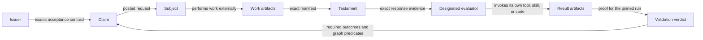
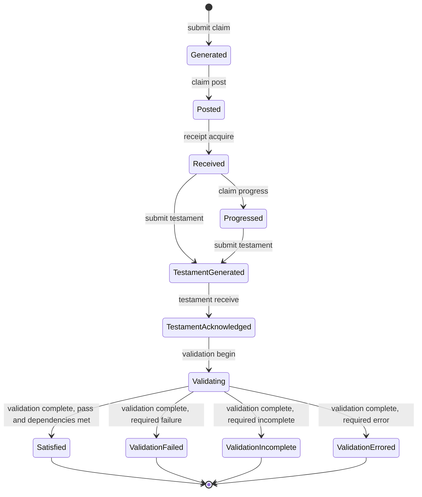
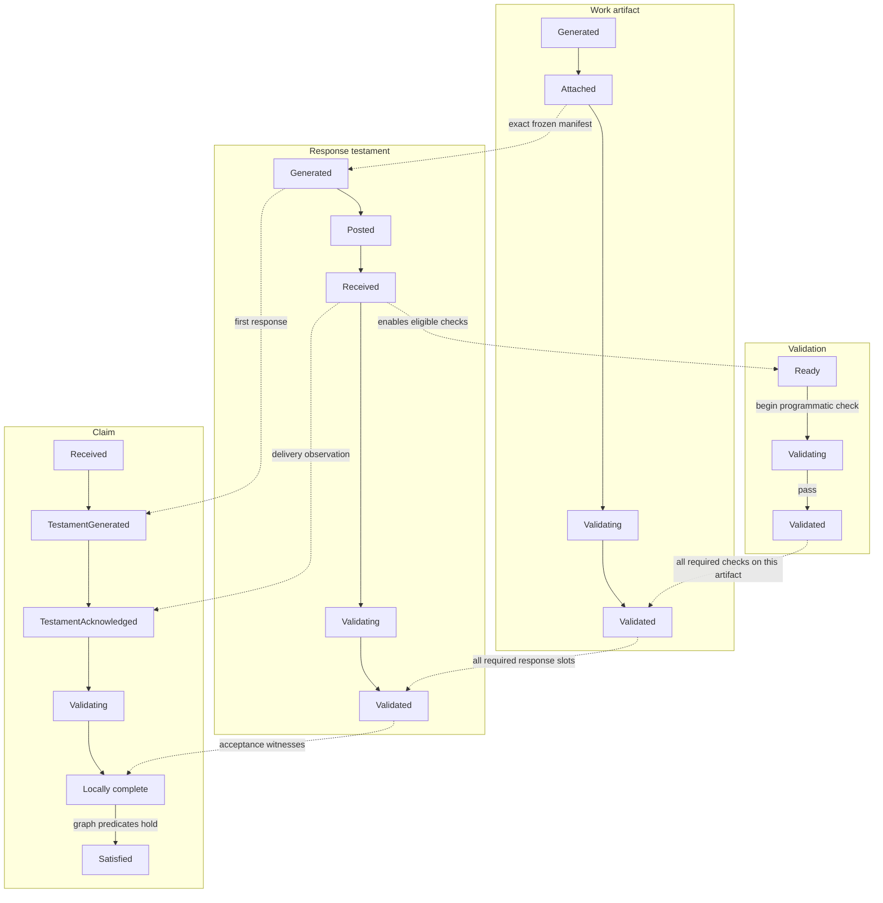
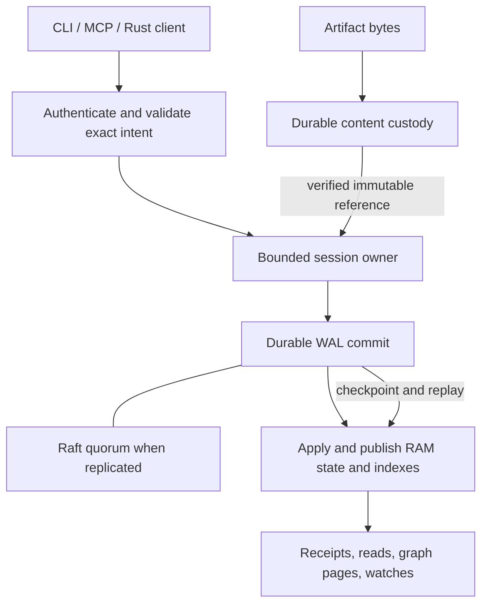

# focal

**Durable coordination for people, agents, and the work they ask of each other.**

[Install](#install-from-source) · [Quickstart](#start-locally) ·
[Objects and lifecycles](#claims-testaments-artifacts-and-validations) ·
[CLI](#use-the-cli) · [MCP](#use-it-with-agents-through-mcp) ·
[Storage](#how-durability-and-memory-fit-together) ·
[Deployment](#grow-without-changing-the-domain-model)

Focal is a Rust protocol and claims ledger. A participant issues a directed claim
with explicit acceptance requirements. Its respondent supplies artifacts and a
testament describing the result. Designated evaluators record checks against that
exact evidence, and the ledger derives whether the requirements and dependencies
are satisfied. The history remains inspectable and recoverable after a restart.

Use it to make a request such as “fix this regression and prove the tests pass”
trackable across tools and participants: who asked, who accepted, what was
delivered, which version was checked, and what actually passed. The CLI serves
people and shell scripts; MCP exposes the same typed operations to agents.

Participants run their own tools, skills, scripts, and agents in any language.
Focal records authorized facts and verifies their consistency; it does not launch
workers or choose a participant's agent framework.

The implementation includes a durable local service, authenticated networking,
replicated ledger components, evidence custody, CLI, and stdio MCP server. Full
independent object lifecycles and automatic deployment across regions are still
being implemented. The [implementation record](docs/archictecutre/09-implementation-status.md)
separates executed checks from the remaining plan.

## Install from source

Use Rust through rustup, Bash, and a native protobuf compiler. The checkout pins
**Rust 1.94.1**; rustup selects that toolchain when building.
Install protobuf with `brew install protobuf` on macOS, or
`sudo apt-get install protobuf-compiler` on Debian/Ubuntu.

```sh
git clone https://github.com/hyper-light/focal.git
cd focal
bash scripts/cargo.sh build --release -p focal-node --bin focal --locked
export PATH="$PWD/target/release:$PATH"
focal --help
```

The `export` applies to this shell. Add that absolute directory to your shell's
PATH configuration, or copy the binary into a directory already on PATH. Source
builds are the installation path documented here. Local qualification runs on
macOS arm64; CI is configured for Linux x86_64 and macOS arm64. Packaged releases
and Windows support remain unqualified. See [building and verification](docs/building.md)
for compiler and dependency details.

## Start locally

In one terminal:

```sh
focal start
```

Leave it running. The service creates a private durable data directory, identity,
and authenticated local Unix socket. The default directory is
`~/Library/Application Support/Focal` on macOS, and `$XDG_DATA_HOME/focal` on Linux
when that variable is set, otherwise `~/.local/share/focal`. No configuration file
or network port is needed. To choose another directory, pass
`--data-dir /absolute/path` to **every** command, including `start` and commands
in other terminals.

In another terminal, generate a valid example and submit it:

```sh
focal schema example claim.submit > claim.json
focal submit claim --file claim.json
focal list claims
focal ledger summary
```

The example is a self-targeted **handoff** with an explicit receipt requirement.
It exercises delivery, not substantive quality acceptance. A fresh submission
prints a new claim ID and records `Generated`. Copy that ID into these commands:

```sh
focal get claim CLAIM_ID
focal claim post CLAIM_ID
focal list claims --source self --status posted
```

Posting makes the claim actionable; generation alone does not. `--target` names a
participant, not a URL or a process to start. `self` means the authenticated
participant; self-targeted `work` is prohibited, while this `handoff` is allowed.
IDs are 32 hexadecimal characters and hashes are 64.

Stop the service with Ctrl-C and run `focal start` again to recover the same
ledger. Local acknowledgment means the write was synced to its disk. The default
single-node service cannot survive destruction of that disk.

### Try a complete evidence workflow

The resumable demo creates a work claim, acquires its receipt, durably stores a
test report, closes and receives a testament, records validation, and establishes
satisfaction:

```sh
focal --data-dir /tmp/focal-demo demo
focal --data-dir /tmp/focal-demo demo
```

The JSON report encodes the claim's `Satisfied` status as `status: 8` and its
`Pass` verdict as `validation: 1`, alongside history and the stored content
reference. `focal schema get domain-registry` explains these frozen vocabulary
codes. Repeating the demo recovers the same claim and proof
without rerunning completed validation. This example owns its directory
exclusively and invokes a built-in validator through the Rust embedding API; use
a separate directory from a running service. `/tmp` is suitable for this
experiment; keep real ledger data on persistent storage.

For the corresponding participant-driven CLI steps, see
[deliver artifacts and a testament](docs/manual-cli.md#deliver-artifacts-and-a-testament).

The durable record answers a different question at each stage: the claim records
what was requested; the receipt records who accepted responsibility; the testament
records what that participant says it delivered; validation records which checks
actually passed. A successful upload or a confident closing statement alone does
not establish that the request was satisfied.

## Claims, testaments, artifacts, and validations

| Object | What it records | What to inspect |
|---|---|---|
| **Claim** | A directed request, immutable acceptance requirements, scope, and relationships to other claims | Issuer, subject, current status, dependencies, and history |
| **Testament** | A respondent's closing statement and exact ordered manifest of delivered artifacts | Summary, outcome, confidence, and artifact IDs plus descriptor hashes |
| **Artifact** | Immutable typed evidence with provenance and inline bytes or a durable content reference | Producer, schema, inputs, descriptor hash, and payload |
| **Validation** | A declared check and its recorded evaluation runs and verdict attempts | Designated evaluator, pinned handler/version, exact target, result, and proof artifacts |

The **issuer** authors the request and acceptance contract. The **subject** is the
participant asked to respond; its execution receipt identifies the current
authorized holder and generation. The **evaluator** is the participant designated
to check the evidence. One participant may fill multiple permitted roles, but
reading a claim or enrolling a physical node grants no evaluation authority.



A validator definition names the evaluator, check kind, phase, required/observe
mode, pinned handler identity/version, and accepted evidence schemas. An agentic
handler and a programmatic handler use the same evidence and result contract.
The participant maps that reference to its own implementation and invokes it;
Focal does not load scripts from a claim or assume a language or agent runtime.
The current model requires a programmatic handler followed by exactly one final
agentic handler when a requirement declares `quality_bar`; an agentic-only check
without that field is supported.
[Peer validation](docs/archictecutre/16-peer-validation-contract.md) explains the
contract and the remaining lifecycle changes.

Receiving a testament proves delivery. A passing required check supplies an
acceptance witness. An observational check remains recorded without blocking
required completion. Claim satisfaction also accounts for declared dependencies;
it is not a caller-supplied success flag. Artifacts submitted as evaluation proof
remain separate from the respondent's already-frozen manifest.

### Lifecycle and coordination

The current implementation's main **claim** path, including validation outcomes:



This is a selected path, not the whole transition table: explicit cancellation,
supersession, expiration, admission failures, and dependency failures have their
own guarded terminal outcomes. Submitting a testament does not itself run a
validator or establish success. The issuer invokes `validation complete` after
the required verdicts are recorded; when dependencies remain, satisfaction can
follow later as they resolve. A recorded failing verdict is a successful write
of that result.

The intended model gives **all four object families their own coordinated
lifecycles**: artifacts can be produced and checked independently, testaments
bundle specific responses, and validation attempts retain their exact targets.
The current stored model still has one closing testament per claim and narrower
artifact/testament state. The [four-family state and authority contract](docs/archictecutre/17-lifecycle-state-and-authority.md)
and [compatible storage migration](docs/archictecutre/18-lifecycle-storage-upgrade.md)
define the remaining work; those target states are not yet available commands.

The following **target lifecycle** view shows why those histories are separate.
Each row is a selected successful path. Dotted arrows coordinate objects without
making their statuses interchangeable:



For example, an artifact can exist before the respondent closes a testament.
Receiving that testament makes its exact evidence eligible for whole-work checks;
it does not mark the artifact as validated. A claim can meet its local acceptance
requirements and still wait for a dependency. Agentic checks have their own
programmatic/quality phase rules, and failed or incomplete outcomes retain their
own terminal cause. Result artifacts and the issuer's final audit testament have
separate terminal roles; they cannot rewrite a response's frozen manifest.

Challenge and consultation policy builds on the same objects. A challenge asks
the respondent for proof addressing the challenger's claim; unmet proof can
justify an authorized corrective claim. A consult asks for work answering a
query and may lead to a follow-up consult. Participant-authored helpers, trusted
child causes, and the complete corrective/follow-up mechanics remain in
[the CLI and agent plan](docs/archictecutre/13-cli-and-agent-implementation-plan.md).

## Use the CLI

Choose human field flags, JSON, YAML, or a file. These three **alternative**
commands author the same claim shape; executing all three creates three claims:

```sh
focal submit claim --target self --action handoff \
  --description 'Deliver the checked report' \
  --validation-json '{"kind":"receipt","phase":"whole_work","mode":"required","description":"Receive the report testament","evaluator":"self"}'

focal submit claim --json '{"target":"self","action":"handoff","description":"Deliver the checked report","validations":[{"kind":"receipt","phase":"whole_work","mode":"required","description":"Receive the report testament","evaluator":"self"}]}'

focal submit claim --yaml 'target: self
action: handoff
description: Deliver the checked report
validations:
  - kind: receipt
    phase: whole_work
    mode: required
    description: Receive the report testament
    evaluator: self'
```

Use `--file claim.yaml` or `--file - --input-format json` for documents and stdin.
The shared Rust builder converts authored input to the expected wire request.
Unknown fields, duplicate keys, and mixed document/field input fail explicitly.
`--format json` and `--format yaml` select structured output; the default serves
human reading. Use `--help` at any command level.

```sh
# Exact objects and recorded evaluation results
focal get claim CLAIM_ID
focal get claim --source PARTICIPANT_ID --target PARTICIPANT_ID
focal get testament TESTAMENT_ID
focal get artifact ARTIFACT_ID --output ./report.json
focal get validation VALIDATION_ID --context --format json

# Every list filter is optional
focal list claims
focal list testaments
focal list artifacts --testament TESTAMENT_ID
focal list validations --claim CLAIM_ID
focal list claims --source self --status posted --all --format json

# Observe and explore
focal claim wait CLAIM_ID --until satisfied --timeout-ms 30000
focal watch claims --name my-claims
focal ledger traverse claim:CLAIM_ID
focal validator list --claim CLAIM_ID

# Discover input contracts without guessing fields
focal schema list
focal schema get testament.submit
focal schema example testament.submit
focal completion bash > focal.bash
```

Filtered singular `get claim` proves there is exactly one match; ambiguity is an
error. Lists use bounded pages at a fixed committed prefix. `--all` follows those
pages incrementally; JSON output is one page per line. Watches retain their
delivery position locally and can resume after interruption. Artifact downloads
publish a complete new file and never overwrite an existing destination.

File uploads use `submit artifact --payload-file FILE` or
`artifact register --payload-file FILE` with the required descriptor fields.
The client saves the bytes before sending, so recovery does not depend on the
source file remaining unchanged. Inspect and cancel retained transfers with
`artifact upload inspect UPLOAD_ID` and `artifact upload cancel UPLOAD_ID`.

Mutations save a durable operation identity before transmission. If a response
is lost, use the printed `focal request retry --operation-id m1:…` command with
the same client context. Starting a new submit command creates a new intent;
it does not resolve the old unknown outcome. Named contexts select local Unix
or authenticated remote QUIC connections through `context` and
`--client-context NAME`.

The [manual CLI guide](docs/manual-cli.md) contains complete evidence/validation
commands, filter matrices, output and exit-code contracts, streaming, context
setup, and exact recovery.

## Use it with agents through MCP

Start the Focal service, then configure your MCP client to launch a stdio server
with this command:

```sh
/absolute/path/to/focal --data-dir /absolute/path/to/ledger mcp serve
```

Use the same data directory as the service, or select a configured remote client
context. Supply the executable and arguments through your client's normal MCP
configuration. The adapter is a separate foreground process: stdout carries
JSON-RPC and stderr carries diagnostics.

For clients using an `mcpServers` configuration, the launch entry is:

```json
{
  "mcpServers": {
    "focal": {
      "command": "/absolute/path/to/focal",
      "args": ["--data-dir", "/absolute/path/to/ledger", "mcp", "serve"]
    }
  }
}
```

Replace both paths. The ledger directory must match the running service; the
client's working directory is irrelevant when these paths are absolute.

Discover every `tools/list` page. Available capabilities cover claim and evidence
mutations, all four get/list families, pinned validation contexts, transfer,
watching, graph traversal, monitors, and durable request recovery. Local network
administration adds operator tools when the selected context provides that
backend. Authored ledger mutations use a separately reserved durable operation
ID; JSON-RPC request IDs alone do not protect a retry after restart. Transfers,
watches, and administration have their own retained identities and recovery
contracts, described in each tool's discovered schema and documentation.

Four packaged instruction skills teach the workflow:

| Skill | Purpose |
|---|---|
| [focal-claims](skills/focal-claims/SKILL.md) | Author and progress claims, inspect dependencies, and recover exact operations |
| [focal-evidence](skills/focal-evidence/SKILL.md) | Produce artifacts, preserve immutable manifests, and submit testaments |
| [focal-validation](skills/focal-validation/SKILL.md) | Invoke external checks and record evidence against the pinned evaluation context |
| [focal-cluster](skills/focal-cluster/SKILL.md) | Inspect and administer authorized local cluster state |

See [MCP setup, tool contracts, and skill packaging](docs/mcp.md). The same
authenticated authority checks apply whether a request comes from a person,
shell script, custom agent, or MCP client.

## How durability and memory fit together

Focal keeps working state and indexes primarily in custom RAM storage. Durable
logs and checkpoints let owners reconstruct that state after restart. Application
sessions have independent ordered histories, while replicated groups use Raft
to agree on committed changes.



The custom storage and ownership model accounts for work, queues, retained reads,
and responses. Pages and scans have explicit bounds, and admission reports
pressure instead of accumulating unlimited work. Owners exchange owned values
and borrow state where possible. Production Rust has a strict no-panic policy;
shared ownership requires a concrete concurrency or dependency reason.

State becomes externally visible after commit. Retries preserve exact request
identity and revision fences. Fresh reads use the applicable quorum barrier;
paginated reads retain one explicit prefix instead of silently mixing versions.
Evidence custody is a separate durability condition: adding a voter does not
prove that artifact bytes were copied to it.

Details: [storage and distribution](docs/archictecutre/04-storage-and-distribution.md),
[ownership and failure policy](docs/archictecutre/10-ownership-and-failure-policy.md),
and [implementation evidence](docs/archictecutre/09-implementation-status.md).

## Grow without changing the domain model

The objective is **one laptop through a globally distributed fleet at Meta
scale**, with stepped complexity: each expansion introduces only the new facts
and decisions needed for that deployment. The same claims, evidence, acceptance,
and retry semantics must survive each step.

| Step | Smallest new operator concern | Current state |
|---|---|---|
| Laptop | Where to retain local data | Durable local service and restart workflow implemented |
| VMs or bare metal | Reachable endpoints, secure membership, desired node-failure tolerance | Invitation/join, authenticated transport, and root/application membership administration implemented; automatic application placement remains open |
| Kubernetes | Persistent storage and deployment packaging | Deployment journey and packaging remain planned |
| Multiple availability zones | Verified failure domains and zone-loss objective | Placement contracts and offline explanation exist; automatic deployment and failure qualification remain open |
| Multiple regions | Residency, eligible regions, and remote durability/latency tradeoffs | Architecture and component work; end-to-end regional operation remains unqualified |
| Global fleet | Per-tenant geography and resource policy | Target architecture; global-scale performance and operations remain unqualified |

To try two networked nodes, follow [start and join a network](docs/network-startup.md).
Joining initially adds a **root metadata learner**, not an application replica or
another evidence copy. [Cluster administration](docs/cluster-admin.md) explains
actual membership, catch-up, invitation revocation, diagnostics, and recovery.
`deployment explain` checks offline intent; it does not activate a stronger
durability guarantee. Deployment apply, drain, credential renewal, and the full
regional journeys remain implementation work.

The [stepped-complexity contract](docs/archictecutre/08-stepped-complexity-and-deployment.md)
defines the product target. Small-cluster correctness tests are not evidence of
global throughput.

## Development and architecture

The Rust workspace separates the domain model and deterministic reducer from
memory storage, durable ledger, evidence custody, transport, shared client
operations, MCP adapter, and node/CLI. The reducer does not invoke tools or read
wall time during replay.

```sh
bash scripts/cargo.sh test --workspace --all-targets --locked -- --test-threads=4
bash scripts/cargo.sh clippy --workspace --all-targets --locked -- -D warnings
bash scripts/check-production.sh
cargo fmt --all --check
python3 scripts/check-contracts.py
```

The production gate checks non-test code separately; tests may use assertions.
The contract checker verifies architecture links, imported Hecate source hashes,
and frozen vocabularies. See [building and checking](docs/building.md) and the
[dependency review](docs/dependencies/README.md) for qualification scope.

| Read next | What it covers |
|---|---|
| [Manual CLI](docs/manual-cli.md) | Human workflows, input formats, lists, transfer, watches, and recovery |
| [MCP and skills](docs/mcp.md) | Agent connection, discovery, exact operation identity, and packaging |
| [Network startup](docs/network-startup.md) | Founder, invitation, enrollment, and restart |
| [Cluster administration](docs/cluster-admin.md) | Live node inspection, root/application membership, and administrative recovery |
| [Architecture index](docs/archictecutre/README.md) | Hecate/Sylk research, design decisions, lifecycle and storage contracts |
| [Implementation plan](docs/archictecutre/05-implementation-plan.md) | Storage, replication, placement, recovery, and scale work packages |
| [CLI and agent plan](docs/archictecutre/13-cli-and-agent-implementation-plan.md) | Shared operations, complete interfaces, and challenge/consult mechanics |
| [Implementation status](docs/archictecutre/09-implementation-status.md) | Executed evidence and remaining acceptance gates |

Licensed under [MIT](LICENSE).
