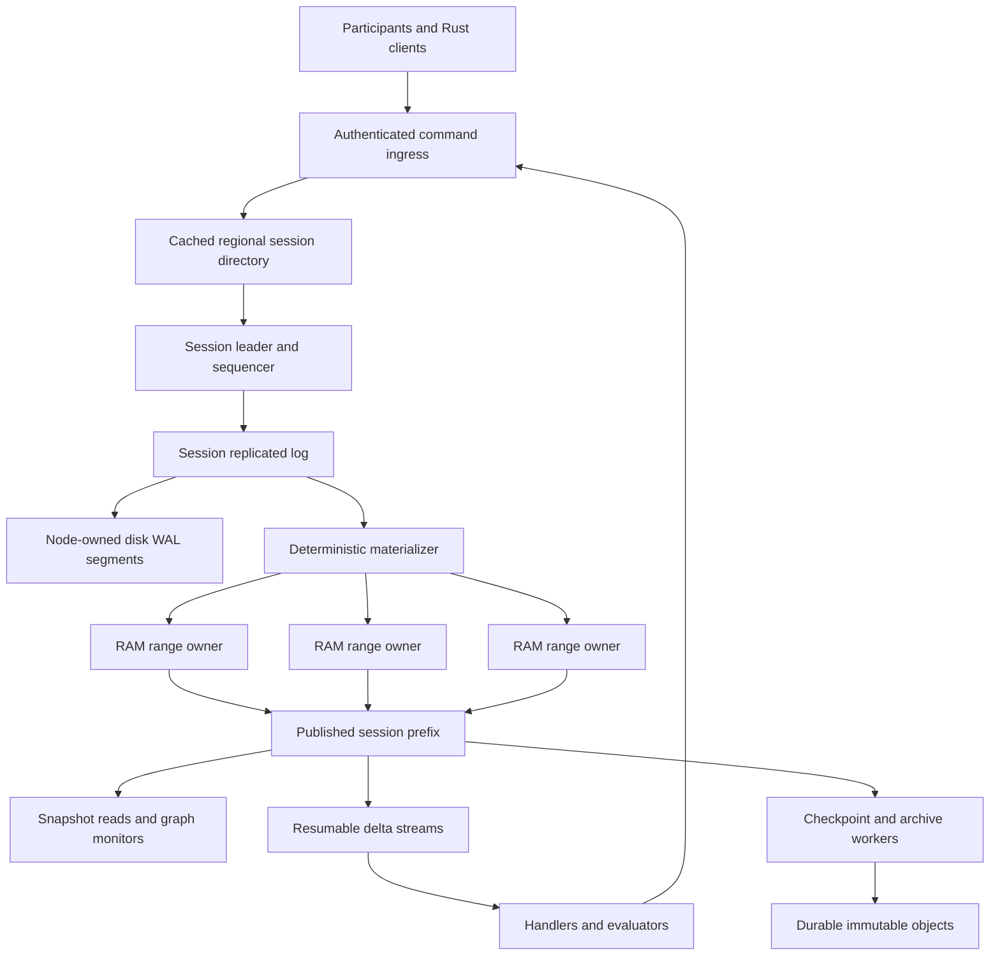

# Target architecture

Status: proposed Focal design. Sources: [Hecate ledger](reference/hecate/docs/architecture/LEDGER.md), [ledger core](reference/hecate/docs/specs/LEDGER_CORE.md), [substrate](reference/hecate/docs/specs/LEDGER_SUBSTRATE.md), [consensus](reference/hecate/docs/specs/CONSENSUS.md), and the [source audit](01-source-audit.md).

## 1. Required outcome

Build a Rust platform whose authority is a durable claims ledger. Claims describe directed work and its requirements; testaments close attempts; validations decide whether the evidence satisfies the requirements; artifacts carry that evidence. Participant categories do not create alternative coordination paths.

The same binary and domain implementation must support:

- An embedded or standalone laptop deployment with one voter, local segment files, and one memory partition.
- Many independent sessions spread across machines and regions, with session placement and discovery partitioned regionally.
- A large individual session whose graph and apply work span memory partitions and machines while preserving one session-wide ordered log.
- Regional outages according to an explicitly selected durability and failure-domain contract.

No source repository demonstrates Meta-scale operation. We will prove safety with executable models and failure injection, then qualify capacity on named hardware and workload distributions. Throughput numbers from unrelated papers are not Focal capacity claims.

Configuration and concepts must grow in the exact minimum useful increment: laptop → VMs/bare metal → Kubernetes → multi-AZ → multi-region → global distribution. [08](08-stepped-complexity-and-deployment.md) defines each added decision, what remains automatic, and how that claim is tested. Deployment packaging must not introduce new domain semantics.

## 2. Product scope

Focal owns the four proof object families, typed relationships, lifecycle, satisfaction, admission affordances, evidence validation orchestration, durable ordering, memory materialization, subscriptions, archival continuation, and Rust client/server integration.

Focal provides integration seams for participant identity, policy decisions, deterministic handlers, agentic evaluators, artifact storage, and observability. A concrete embedded adapter and network adapter exercise each external seam. Host applications may supply an evaluator or policy authority without accessing ledger internals.

Hecate's VM launcher, coding-agent roster, VFS, merge engine, model gateway, token billing, and complete IAM implementation are reference context. They are not prerequisites to a general claims platform. Their operations use claims through the same public interface when integrated. Actual filesystem, payment, or third-party effects cannot be made atomic merely by recording a claim; effect adapters must state their idempotency and recovery contracts.

## 3. Authority and data planes

The log owns order and durable decisions. The memory store owns materialized reads. The sequencer owns admission against effective state. The materializer owns deterministic execution. Validators produce new result inputs; they do not mutate graph slots. Subscribers consume immutable committed deltas; they do not decide truth by observing progress text.

The regional directory owns placement and discovery metadata. A session's committed routing epoch owns whether a partition may serve that session's keys. Cached directory information cannot grant write authority.

## 4. Invariants

| ID | Invariant |
|---|---|
| I01 | Every acknowledged successful mutation is durably committed under the selected failure-domain contract. One voter includes a successful local disk flush. |
| I02 | State, terminal results, and deltas are deterministic functions of a committed session-log prefix. Recovery executes no handler, validator, or external effect. |
| I03 | Immutable authored content and system-managed lifecycle have separate Rust write paths and separate hash treatment. |
| I04 | Reads expose a complete published prefix; one mutation never becomes partially visible across ranges. |
| I05 | SessionSeq, RaftIndex, routing epoch, object revision, and physical WAL offset are distinct types and clocks. |
| I06 | Every proof edge stays within a session. Cross-session references are inert evidence; work must be issued as a new claim in the receiving session. |
| I07 | Retired proof remains identifiable and retrievable indefinitely in the initial contract. Hot/WAL/cursor retention is bounded separately. Hot-slot eviction cannot silently turn a duplicate into new work. |
| I08 | All memory consumers and background work have admission budgets; overload is explicit and no proof-bearing input is silently dropped. |
| I09 | Terminal claims cannot be repainted by progress, late runtime failures, or stale evaluator results. Corrections have new identities and explicit lineage. |
| I10 | The data/apply range map is one map. Serving-cache ownership never becomes a second claims-authority partition map. |
| I11 | Only the fenced session leader originates execution assignments. Durable assignment tokens fence stale workers and evaluator attempts. |
| I12 | Required validations pass before satisfaction. Receipt establishes delivery only. Observe-only validators do not gate completion. |
| I13 | Consumer recovery uses committed deltas and durable cursors; there is no independent outbox table. |
| I14 | Fleet growth creates more bounded session and metadata groups, not an unbounded global log, membership broadcast, or all-session scan. |
| I15 | Laptop, parallel, sharded, and geographic deployments run the same state machine and serialization rules. |

## 5. Ordering and acknowledgement

There is one total order per session. Different sessions run independently and have no global relative ordering guarantee. A session leader pipelines proposals after checking them against committed lifecycle state plus the ordered pending overlay. Losing leadership discards speculative effects and rebuilds them from committed state; a pending proposal is not proof.

A normal successful mutation response includes its durable `SessionSeq` and published visibility token. It is returned after both durable commit and the relevant publication barrier. A client timeout has an unknown outcome: retry the same request identity or query its receipt. Never treat timeout as proof that nothing committed.

Read interfaces distinguish linearizable session reads, reads at a fixed retained snapshot, and explicitly stale projection reads. A linearizable read establishes current leader authority using the consensus adapter, translates its barrier to a session sequence, and waits for materialization. A multi-range traversal pins one prefix and one routing epoch across all continuation pages for its bounded lease; expiry returns a typed restart requirement. Merely reading the latest local map is not linearizable.

## 6. Scale architecture

### Across sessions

Assign each session a home region, ordering group, placement record, and memory-range directory. Regional metadata groups partition session IDs; stable root metadata contains regional delegation, not every session, every claim, or every request. Clients cache only routes they use and maintain bounded watches or versioned lookups. A directory cache miss follows hierarchical lookup; the steady-state data path contacts the owning session directly.

Multiple logical session logs share node-owned WAL segments and group flushes. Admission, scheduling, buffer credits, and recovery are fair across sessions. The WAL multiplexer must support independent logical log replay and retention without forcing a separate filesystem descriptor, timer, transport connection, or task per idle session. Activate session machinery on demand with bounded idle-state eviction backed by durable descriptors.

Connection pools are bounded per region/node peer; sessions multiplex over them. Heartbeats belong to live consensus groups and transport liveness, not per-claim polling. Per-node resource controls enforce tenant and session quotas before allocation.

### Within a session

Parallelize independent deterministic apply work. Range-partition graph objects and indexes; split by measured bytes, read/write demand, and graph locality. Keep claim-owned testaments, validations, and evidence metadata near their claim where practical. Cross-claim dependencies can cross partitions and require one ordered transaction and visibility barrier.

The session sequencer and cross-range publication barriers remain finite ceilings. High-conflict work remains serial for the conflicting keys. Replicas do not increase write throughput for a single hot key. Splitting index buckets can improve fan-in storage and reads, but cannot split an indivisible lifecycle decision into independent authorities.

If a workload exceeds a session's measured ordering or serial-conflict capacity, use explicit independent sessions where its semantics permit, or propose a new consistency model as a separate architecture decision. Never silently shard one session's authoritative log to claim unlimited scale. P14 measures the ordering ceiling, graph-control projection size, range barrier amplification, and per-session head-of-line blocking.

### Across regions

Region placement is data, not a separate implementation mode. Each session placement declares which failures it promises to survive and where its log voters and durable artifact copies live. The regional placement planner checks those constraints before declaring the session writable.

| Placement contract | Acknowledgement | Region-loss behavior |
|---|---|---|
| Laptop / one voter | Local durable append | Process/power-loss restart recovers on intact storage that honors flushes; loss of its only disk is outside the guarantee |
| Regional fault tolerance | Durable voter majority spread across configured node/AZ failures | An entire region can be unavailable; no advertised zero-loss automatic promotion outside its quorum |
| Synchronous multi-region | Durable quorum spread so surviving regions retain a voting majority under the promised outage | Surviving majority elects and serves; cross-region RTT is in the write path |
| Disaster-recovery copy | Primary contract plus explicitly lagging remote archive/backup | Restore to a known prefix with a reported recovery point; never described as synchronous zero-loss failover |

Example topology tests include three voters in three regions to survive loss of any one region, and five voters distributed 2/2/1 to survive loss of either two-voter region. These are test configurations, not universal deployment defaults. Validate quorum survivability against every promised failure set, including correlated storage and artifact failures. A 2/1 two-region split does not survive loss of the two-voter region without sacrificing quorum safety.

The consensus contract is crash-fault tolerant, not Byzantine. Authentication protects peers and requests; it does not turn Raft into Byzantine consensus. Quorum and stable-state requirements follow the [Raft specification](https://raft.github.io/raft.pdf). Focal's regional placement and policy behavior above are design choices.

## 7. Memory and durable storage

Custom generational arenas hold objects; typed indexes and immutable published views support bounded reads. Durable artifacts larger than metadata reside in content-addressed chunk storage, with bounded RAM caching. RAM occupancy includes replicas, indexes, pending proposals, monitor closures, delta buffers, snapshots, and recovery staging; object payload counts alone are insufficient.

The durable truth is the committed input log plus verified checkpoint/archive objects. Checkpoints shorten replay; archive custody permits terminal graph eviction; neither can justify deletion before its completeness is durably established. The authoritative RAM store does not require an LSM, SQLite, Redis, or RocksDB. Hecate's cold LSM/B-tree engine is an explicit adaptation, documented in [04](04-storage-and-distribution.md).

A live graph can exceed aggregate provisioned RAM. The response is admission backpressure and placement expansion, not eviction of unresolved obligations. Reserve capacity for completions, deadline outcomes, cursor control, and retirement so overload does not prevent work from becoming reclaimable.

## 8. Reliability seams and execution guarantees

Ledger submission retries can produce one durable logical transition through request identity, expected revision, and content identity. Delivery is resumable and may redeliver around lost acknowledgements. A consumer advances its durable cursor only after its own effect commits.

An arbitrary third-party effect cannot be made exactly once by a cursor or dedup LRU. Execution adapters accept a durable operation ID and fencing token, use provider idempotency where available, and expose an indeterminate result when an effect could have happened without a recorded result. Reconcile that result before issuing an unsafe new attempt. This applies to validators with effects as well as ordinary service claims.

## 9. Completion boundary

The initial task is this documentation baseline. The system is production-complete only after all gates in [05](05-implementation-plan.md) and [06](06-verification-and-operations.md) pass: laptop restart, multi-node failover, range movement, bounded memory under long-running load, multi-region quorum survival, archival retrieval, compatible upgrades, and measured capacity envelopes.

Do not market a small cluster test as proof of Meta scale. Publish the tested envelope, known ceilings, raw benchmark metadata, and the extrapolation assumptions separately.
