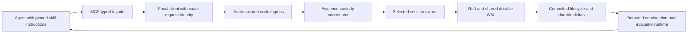

# Agent tools, skills, consults, and challenges

Status: researched architecture with partial implementation, 2026-09-05. The local `focal mcp serve` adapter now exposes the shared authored-operation registry and durable operation recovery. The executable surface and thin skills are documented in [the MCP guide](../mcp.md). Authenticated remote MCP, generated capability-specific skill publication, agent continuation storage, and exchange/remediation policy remain required work.

The [protocol-specific research](14-mcp-protocol-research.md) pins the current MCP revision, defines narrow legacy compatibility, and records the bounded Rust transport and interoperability gates for these proposed tools. The [manual CLI](../manual-cli.md) supplies the currently executable path.

This document answers how an agent should operate Focal's claims ledger without acquiring lifecycle or cluster authority. It distinguishes Hecate's accepted design, Sylk's inspected implementation, the user's requested behavior, and the additional Focal integration required. It supplements [the lifecycle model](02-domain-and-lifecycle.md), [Rust interfaces](03-rust-workspace-and-interfaces.md), and [the implementation plan](05-implementation-plan.md).

## 1. Evidence and precedence

The research used the local sibling checkouts, including their applicable `AGENTS.md` files. Hecate HEAD was `103c0785d2623c19d0c02a450e94677bbfc70359`; Sylk HEAD was `50154e6159c7ed590728b82423dde3e7fc977c26`. These identify the checkouts, not a claim that their working trees were clean. Hecate citations use the imported frozen reference copy (the architecture `AGENTS.md` is preserved as `AGENT_MODEL.md`); Sylk links resolve against its sibling checkout. Line references identify the inspected source. Hecate sources are architecture/specification evidence, not evidence of a running implementation. Sylk Go sources are implementation evidence, not Rust code to port mechanically.

Precedence for this proposal is the user's current instruction, then the accepted Focal contracts, then reconciled Hecate specifications, with Sylk supplying concrete lessons. In particular:

1. The user requires a challenge to impose a proof obligation: the responding agent must supply artifacts proving the challenger's claims; failure calls for corrective claims. A consultation requests satisfactory work and normally proceeds through follow-up consultations when more work or clarification is needed.
2. Hecate makes claims, testaments, validations, and artifacts the only work-completion authority. A transport reply, progress message, tool return, or agent's assertion of success cannot substitute for the lifecycle. [Hecate LEDGER §§1–3](reference/hecate/docs/architecture/LEDGER.md#L8)
3. Hecate's later accepted `SKILLS_API.md` explicitly amends the older architecture: TypeScript/Python are **authoring-time bindings producing canonical documents**, with no skill interpreter in the pod. The older `SKILLS.md` says handler bodies execute in TS/Python runtimes; that paragraph must not be adopted as the current contract. Focal remains Rust; any optional declaration SDK emits data consumed by Rust. [Accepted amendment](reference/hecate/docs/specs/SKILLS_API.md#L1), [superseded architecture wording](reference/hecate/docs/architecture/SKILLS.md#L51)
4. Hecate describes a `skill://` MCP resource and references a proposed MCP extension. This document records Hecate's intended projection, without claiming that the referenced extension is a current ratified MCP requirement. Protocol-version/extension compatibility must be checked against the actual MCP implementation selected for Focal before implementation. [Hecate publication contract](reference/hecate/docs/architecture/SKILLS.md#L26)

## 2. What the sources actually say

### 2.1 The shared substrate

A claim states an obligation and its satisfaction requirements. The responder streams immutable evidence, then closes a testament with its exact artifact manifest. Receipt proves that the testament arrived; quality validations decide whether its evidence is sufficient. Missing evidence, negative evidence, and evaluator failure have distinct outcomes. Issuer-authored content and runtime-written lifecycle are disjoint. Hecate's glossary takes precedence where older architecture language conflicts. [Hecate glossary](reference/hecate/CONTEXT.md#L8), [object model and lifecycle](reference/hecate/docs/architecture/LEDGER.md#L29)

Hecate treats both consults and challenges as ordinary claim action types. Challenges target an activity or artifact using concrete evidence, not an agent's reputation. Its rank contract permits clarification while restricting overrides; Guardian exceptions and office permissions belong to the harness authority model. Cyclic consultation is legal: `awaits` waits for terminality, `depends_on` requires satisfaction, and parked work resumes through durable graph/delta machinery. [Agent authority contract](reference/hecate/docs/architecture/AGENT_MODEL.md#L62), [graph and affordances](reference/hecate/docs/architecture/LEDGER.md#L130)

Hecate's shared skills are compact façades over these operations, with a small default surface and progressive activation/deactivation. Forbidden capabilities are absent from the installed role bundle. A registry supplies pinned definitions; it does not become a routing or claim-authoring authority. [Shared façade design](reference/hecate/docs/architecture/SKILLS.md#L69), [registry definition](reference/hecate/CONTEXT.md#L145)

### 2.2 Sylk's consult implementation

`newParentedConsultClaim` creates a parented `ActionTypeConsultation` claim with a durable deadline and a required receipt validation whose quality bar is `response.received`. `postGeneratedPeerClaim` goes through generated and posted lifecycle operations using a stable per-claim idempotency key. The full query is also carried in Sylk's activity payload; the claim title is only a preview. Focal should put the complete required work in durable claim content or referenced immutable evidence, rather than require a separate telemetry lookup to reconstruct the obligation. [Claim construction and posting](../../../sylk/agents/shared/cross_pipeline_skills.go#L317), [programmatic consult path](../../../sylk/agents/shared/cross_pipeline_skills.go#L402)

Sylk's documented policy permits a receipt-only consultation or a consultation with stronger inspection requirements. Its actual receipt-completion helper refuses to treat a non-receipt requirement as satisfied by delivery: `SatisfyReceiptForTestament` only completes claims whose required validations are all receipts. [Lifecycle specification §10](../../../sylk/docs/CLAIMS_AND_TESTAMENTS_LIFECYCLE.md#L807), [receipt-only implementation](../../../sylk/core/claims/board_lifecycle.go#L657)

Sylk's continuation machinery can wake on a posted/received/validating testament before the claim's quality evaluation finishes. That is useful for delivering an answer to its evaluator, but it is not proof of satisfactory work. Its `testamentResolvesAwait` also contains a legacy empty-lifecycle acceptance case; this compatibility behavior is not a proposed Focal predicate. [Continuation resolution](../../../sylk/agents/shared/consult_continuations.go#L1247)

### 2.3 Sylk's challenge implementation

`challenge_peer` requires a specific `target_activity_id` and nonempty evidence, resolves the activity's author, applies role-target checks, and creates an ordinary challenge claim. The claim records the disputed activity as a deduplication key and has a required **Inspection** validation. However, the generated quality bar is only `resolution.received`; the description permits defend/yield/scope-split/escalate responses. That is a useful exchange mechanism, but it does not itself encode the user's stronger requirement that artifacts prove the challenger's claims. [Target resolution and admission](../../../sylk/agents/shared/cross_pipeline_skills.go#L112), [generated challenge requirement](../../../sylk/agents/shared/cross_pipeline_skills.go#L254), [claim-backed yield test](../../../sylk/agents/shared/challenge_peer_derivation_test.go#L15)

Sylk's lifecycle document explicitly permits rebuttal, acceptance, correction, or error artifacts, and separates response receipt from challenge satisfaction. Therefore a response labeled “defended” or “resolved” cannot be translated directly to a Focal `Pass`. It must be evaluated against the actual challenged assertions and declared quality bars. [Challenge semantics](../../../sylk/docs/CLAIMS_AND_TESTAMENTS_LIFECYCLE.md#L835)

Sylk exposes both dedicated peer helpers and a claims-native route: `ClaimsCrossPipelineSkills` deliberately returns no dedicated consult/challenge skills for claims-based pipelines, where `post_action` supplies the same action types. Focal should have one implementation path, with any ergonomic `peers` façade compiling into the same claim commands as the `claims` façade. [Two registration paths](../../../sylk/agents/shared/cross_pipeline_skills.go#L49), [general claim tools](../../../sylk/core/claims/skills.go#L261)

### 2.4 Correction is a policy decision with an author

Sylk's `postTerminalTestamentCorrectives` is a generic, configurable policy over incomplete/failed/errored testament validation. It excludes corrective claims to avoid direct recursive correction, bounds claims per outcome, and uses an outcome-derived idempotency key. It does **not** exempt consultation claims or require the original action to be a challenge. Thus “consult failures never create correctives” is not an inherited implementation invariant. [Remediation policy](../../../sylk/core/claims/corrective.go#L24), [terminal-outcome handling](../../../sylk/core/claims/corrective.go#L145), [identity and posting](../../../sylk/core/claims/corrective.go#L280)

Sylk's advisory projection expressly does not decide whether an exchange result needs corrective work; the receiving agent interprets the result against its validations. Hecate is more explicit about authorship: the Architect is the canonical corrective author and monitors do not author fixes. Its merge contract fixes forward through new claims and superseding evidence. [Advisory-only projection](../../../sylk/core/claims/consult_advisory.go#L11), [corrective author](reference/hecate/docs/architecture/AGENT_MODEL.md#L189), [fix-forward gate](reference/hecate/docs/architecture/LEDGER.md#L201)

## 3. Focal exchange contract

Everything in this section is the proposed Focal policy satisfying the current user instruction. It is encoded as pinned claim requirements plus a recovery-safe agent workflow, not as a second lifecycle state machine hidden in tool handlers.

### 3.1 Challenge: respond with proof, or enter corrective work

The challenging agent authors explicit assertions and a bounded evidence requirement for each assertion. For example: “Every accepted write is durable across owner restart” needs a cited protocol argument, an exact test/build basis, and the relevant restart result; a prose claim that tests passed is insufficient. The challenge points to the precise original claim/artifact and records why that evidence is in dispute.

The responding agent must produce artifacts proving the challenger's claims under those requirements. A required validation binds each requirement to an evidence schema, a quality bar, an authorized evaluator, and any pinned deterministic validator. Receipt validation remains separate. The default challenge template must refuse to silently downgrade a proof obligation into `resolution.received` or a receipt-only requirement.

The response may explain a refusal, impossibility, missing premise, or counterexample. These remain legitimate terminal testaments; they are not successful proof merely because they are well formed. A rebuttal satisfies the challenge only if the challenge's explicit validation contract accepts that form of answer. Otherwise it produces the appropriate non-pass outcome and the corrective author handles the identified defect in the work, specification, or evaluation. This preserves honest evidence and the user's proof requirement without forcing an agent to fabricate support for a false assertion.

| Validated result | Challenge handling |
|---|---|
| Required proof passes | The existing runtime completes the claim through its normal lifecycle. |
| Required proof is absent | Record `Incomplete`; create a durable corrective-author obligation identifying the missing proof. |
| Supplied proof violates the quality bar | Record `Fail`; create a corrective-author obligation citing the failing evidence and requirement. |
| Evaluator execution fails | Record `Error` and durable diagnostic evidence; follow the pinned retry/fallback policy. If the outcome is terminal, corrective work targets the actual evaluation/infrastructure defect, not an invented defect in the responder's work. |
| A transport call is unavailable or has an unknown outcome | Resolve the exact original request key before deciding whether a claim or verdict exists. A transport failure is not a fabricated failed challenge. |

The corrective author receives the exact original claim, testament, validation run, and evidence references. It creates ordinary `Correction` claims with their own subjects, scope, and validations. The original failure remains immutable. A corrective claim's eventual success does not retroactively change the original verdict.

Use a stable obligation identity derived from the original ledger, challenge, terminal testament/run, policy revision, and corrective-author office. Persist obligation acceptance and the resulting claim identities before acknowledging its durable stream position. Re-delivery must locate the same corrective work. Avoid an automatic recursive loop: a failed corrective returns to the bounded owning workflow for judgment and escalation, rather than manufacturing an unbounded tree of corrections.

### 3.2 Consult: satisfactory work, then targeted follow-up

A consultation requests concrete work or information. The default Focal consult template includes a receipt plus a required quality validation describing what makes the answer satisfactory. A deliberately selected receipt-only template remains useful for a delivery acknowledgment, but must be named and presented as that limited contract; it is not the default for work requiring judgment.

If a consultation exposes residual uncertainty or produces insufficient work, the normal next action is a new, narrower consultation. Its description names the unresolved question, references the earlier testament/evidence, and preserves the original parent work. Its requirement set is explicit; it cannot reuse the previous claim ID with different content. Existing terminal results remain unchanged. Use `Refines`/`DerivedFrom` against permitted claim endpoints and artifact input references as appropriate; do not invent a cross-family edge that the installed domain model does not yet support.

Follow-up consultation is still bounded work. The agent needs an explicit remaining work budget and a deadline, and should reuse satisfactory evidence or track an already active exchange. Rephrasing the same question must not reset the budget. When no useful narrower question remains, report the unresolved state to the original claimant rather than creating an endless consult loop.

Consultation is not exempt from corrective work when it reveals a separately actionable defect. That is an explicit new corrective judgment with evidence, not a universal `Consultation + Fail -> Correction` reducer rule. Conversely, the normal “please complete or clarify this answer” path remains a follow-up consultation as requested by the user.

### 3.3 Separate observation, evaluation, and dependency release

The agent may receive a testament promptly so it can evaluate it while its parent work remains parked. The tool result must distinguish:

- **Posted:** the claim command committed; no response is implied.
- **Testament available:** the exact closing evidence is available; quality may still be pending.
- **Terminal:** the claim reached a terminal status, including a failure.
- **Satisfied:** required validations passed under the authoritative lifecycle.

These are projections of existing committed objects and deltas, not four new claim statuses. Focal currently has monitor predicates `Terminal`, `Satisfied`, and `Released`; testament notification should use the durable event stream and exact object lookup, not silently extend `WaitPredicate` through a string escape hatch. [Current monitor types](../../crates/focal-model/src/objects.rs#L311)

Use `Awaits`/terminality when the parent needs the result even if it failed. Use `DependsOn`/satisfaction when successful work is a hard prerequisite. If a consult continuation is waiting for satisfaction, it cannot be released by tool completion or by a posted response. The evaluator can be scheduled independently without releasing the parent's blocked obligation. A parked turn owns bounded durable continuation metadata; it does not occupy a model worker waiting on another model worker.

## 4. One tool plane, one claims authority

Hecate explicitly separates MCP tooling from claims-plane transport. Focal should preserve that division while reusing its existing Rust client and authenticated ingress instead of implementing another ledger protocol inside MCP. [Hecate transport separation](reference/hecate/docs/architecture/LEDGER.md#L241), [Rust-only claims plane](reference/hecate/docs/specs/PROTOCOL.md#L9)

An MCP call is an authenticated participant asking for an allowed operation. Its parameters cannot set `AuthorityContext.runtime`, mint an issuer, alter the authenticated tenant, supply a trusted `EvidenceAttestation`, select an arbitrary placement revision, or bypass the selected session incarnation. Existing Focal ingress already separates Actor, Evaluator, Runtime, and Replication capabilities and overwrites runtime context from trusted identity. Node transport credentials are not agent credentials. [Current capability mapping](../../crates/focal-wire/src/auth.rs#L140), [trusted input model](../../crates/focal-model/src/command.rs#L5)

Artifact operations must go through the selected service's evidence path. The existing `FleetService` routes upload sealing through the evidence coordinator and probes exact artifact receipts before doing new custody work. `ManagedService` keeps the selected replica incarnation through this operation. A façade must not call the low-level content owner's private seal and present that as aggregate policy satisfaction. [Evidence-aware request handler](../../crates/focal-node/src/evidence_service.rs#L923), [managed incarnation selection](../../crates/focal-node/src/managed_service.rs#L41)

The adapter holds response allocations through JSON serialization and transport completion, mirroring `OwnedResponse`. Exporting a plain envelope and dropping its allowance before a large MCP response is sent would reintroduce unaccounted memory. [Existing owned response seam](../../crates/focal-wire/src/handler.rs#L8)

## 5. Released operations and planned workflow façades

The released local catalog uses individual stable operation names from [the shared registry](../../crates/focal-client/src/operations/catalog.rs), with typed schemas and server-side standing checks. It provides 16 authored operations plus `request.inspect` and `request.retry`; [the executable guide](../mcp.md) lists them. The broader façades below group remaining workflow requirements; these names are not registered tools. Runtime/evaluator mutation and cluster administration remain absent from this initial catalog.

| Façade | Actions | Existing mechanism or required addition |
|---|---|---|
| `focal_claims` | `draft`, `post`, `accept`, `progress`, `get`, `list`, `traverse`, `wait` | `GenerateClaim`/bounded batch, `PostClaim`, `AcquireReceipt`, `RecordProgress`, bounded read/traversal, `RegisterMonitor`. `list` supports optional source, target, status, action, scope, and parent filters; indexed list operations exist; durable actor/continuation composition remains required. |
| `focal_evidence` | `begin`, `upload`, `attach`, `testify`, `get`, `list` | `BeginEvidenceSet`, bounded upload through the evidence-aware node service, `AttachArtifact`, `CloseTestament`, authenticated reads. `get`/`list` select artifacts or testaments, with optional claim, testament, producer, schema/kind, and lifecycle filters where meaningful. `testify` closes an explicit immutable manifest and includes success/partial/refusal/impossibility/interruption/failure outcome. |
| `focal_peers` | `consult`, `challenge`, `track` | Policy-checked construction of the same claim operations above; exact claim/artifact targets, explicit requirements, and durable subscriptions. No direct peer execution RPC or separate exchange store. The policy, target resolver, and projection indexes are new work. |
| `focal_validation` | `get`, `list`, `results`, `inspect`, `evaluate` | Bounded requirement/run/result inspection with optional claim, evaluator, kind, phase, mode, attempt, and verdict filters where meaningful. Submit `RecordFencedValidationVerdict` through the authenticated evaluator path. The agent supplies evidence and a typed verdict, never a raw status edit. Indexed queries and fixed-prefix validation results exist; an agentic executor/provider bridge remains required. |
| `focal_admin` — separately installed operator surface | `status`, `inventory`, `invite`, `join`, `membership`, `transfer`, `drain`, `credentials`, `deployment`, `diagnostics`, `backup`, `recovery` | Typed projections of the [CLI operation contract](13-cli-and-agent-implementation-plan.md#2-command-and-result-conventions) and [P18 administration matrix](13-cli-and-agent-implementation-plan.md#4-p18--complete-manual-cli-and-deployment-commands). Each action requires its actual operator grant and committed control path; several backend operations remain planned. This façade is absent from ordinary agent bundles and Node-only identities. |

This mapping is grounded in the commands that exist today, rather than Sylk's string-valued `claims_json`/`testaments_json` interfaces. Focal uses typed closed vocabulary for actions, lifecycle, relations, and verdicts; open artifact kinds still need registered schema validation. [Current commands](../../crates/focal-model/src/command.rs#L25), [object schemas](../../crates/focal-model/src/objects.rs#L105), [closed vocabulary](../../crates/focal-model/src/vocabulary.rs#L26), [Sylk JSON façades](../../../sylk/core/claims/skills.go#L264)

Important mapping restrictions:

- `draft` means durable generated claims; `post` separately activates them. A convenience action that drafts and posts is a recoverable sequence with separate exact request keys, not a falsely atomic two-call transaction.
- `accept` obtains the responder receipt/fence under the authenticated subject. The model cannot adopt somebody else's receipt or choose an elevated epoch.
- `progress` is observational. A terminal target returns readable graph truth rather than being reopened.
- `testify` contains the explicit evidence set and exact artifact references; it does not automatically acknowledge or satisfy the claim.
- `evaluate` binds ledger, validation ID, attempt, phase, handler version, manifest/target, evaluator, and receipt fence. No “pass claim” action exists. Missing required schemas cannot produce `Pass` or `Fail`; those are `Incomplete`/`Error` with a diagnostic under the existing core contract.
- `track` may observe another exchange without adding a blocking edge. A deliberate hard dependency must be stated separately and is subject to normal graph/deadline semantics.
- `get`/`traverse` always specify an entry point and bounded items/bytes/work. There is no unbounded session-wide “dump all claims” tool.
- `list` filters are all optional for every object family. Omitting them returns a bounded page from the selected authorized ledger. Filters compose with AND; repeated values within a filter use a documented set rule. Unsupported combinations reject explicitly. Pagination binds principal/scope, filters, sort order, fixed read prefix, visited position, and expiry; even an empty filtered page carries continuation when scan work remains. Artifact-by-testament queries follow that immutable manifest at the same prefix. Validation results distinguish the requirement, run, attempt, verdict, and proof. These query surfaces are planned additions, not claims that the present wire reader already implements each filter.
- Carry-forward, history, and search can become further façade actions only when their actual storage and authorization seams exist. An omitted handler must not return a plausible empty result.

The core already treats receipt validation separately, checks pending attempts and authority on verdict recording, and performs deterministic phase transitions. The runtime executes registered handlers outside the reducer, then commits results and diagnostics as ordinary inputs; replay executes neither models nor validators. [Validation reducer](../../crates/focal-core/src/validation.rs#L95), [runtime execution contract](../../crates/focal-runtime/README.md#L37)

### Runtime-only operations stay off the model surface

Do not expose `AcknowledgeTestament`, `BeginWholeWorkValidation`, `CompleteWholeWork`, timer firing, receipt adoption, scope release, cursor administration, root enrollment, membership changes, or placement publication as generic tool actions. They remain operations of the authorized owning runtime or operator. A tool can request a permitted intent; it cannot supply the authority that executes it. Exact current capability assignments are defined by code, not by a skill description. [Capability mapping](../../crates/focal-wire/src/auth.rs#L150)

In particular, a challenge must not let a lower-authority agent add an override-shaped relation merely because it used the `peers` façade. Hecate's full rank policy and Focal's cross-family relation profiles are not completed integration. Initially expose only the authority-safe subset that the real core accepts; unsupported override semantics remain unavailable until policy checks and conformance tests exist. [Current limits](../../crates/focal-core/README.md), [Hecate rank semantics](reference/hecate/docs/architecture/AGENT_MODEL.md#L66)

The operator façade is a distinct capability surface, not an exception to this rule. It uses the same typed operation registry as the manual CLI; it must not expose arbitrary control envelopes, manufacture a ready/custody proof, or accept a model-provided desired state as already committed. Enrollment, learner admission, promotion, placement, and activation are separate outcomes. A deployment plan is reviewable desired work bound to exact metadata revisions; applying it reports actual committed progress. Basic health/inventory reads should not require needless approval prompts, while privileged mutations still require the relevant authenticated operator authority.

## 6. Typed skill definition and instructional content

Follow the accepted Hecate shape: one Rust action/output definition produces tool schemas, static contract metadata, a content-digested instruction resource, catalog entries, and dispatch validation. Built-ins retain owned/borrowed client handles and immutable configuration, not work-bearing state between calls. Saved work belongs in the ledger or the owning durable continuation store. [Accepted skill API](reference/hecate/docs/specs/SKILLS_API.md#L12)

Focal already uses Serde and Postcard; adopting Hecate's separate no-Serde wire-generation machinery is not a prerequisite for adding a correct MCP projection. Choose one source of truth for Focal's tool DTOs and generate its JSON schemas and instructions/catalog conformance checks from it. Keep domain canonical hashing and frozen request identities in the existing model. Do not maintain independently handwritten JSON schemas that silently disagree with the Rust adapter.

Each installed skill should declare:

| Field | Purpose |
|---|---|
| Namespaced ID, version, digest | Pin the instruction/schema content used for a turn; prevent external shadowing. |
| Action/input/output schema | Reject unknown critical actions and malformed values before owner admission. |
| Required capabilities and allowed roles | Determine which actions can be installed and which still need runtime authorization. |
| Consumed and produced artifact schemas | Make the evidence contract discoverable and checkable. |
| Retry and cancellation behavior | State exact retry-key reuse and distinguish unknown outcome from definite refusal. |
| Bounds | Declare maximum request, response, graph work, upload chunk, and continuation resource use. |
| Workflow instructions | Explain proof obligations, quality bars, progress versus completion, and follow-up behavior. |

These are declaration metadata, not grants. Capability activation cannot widen the authenticated principal's rights. User/external skill instructions are untrusted input; digest equality proves content identity, not trust. If declaration SDKs are added, they should emit canonical data and pure field mappings to existing typed façades or provisioned tools, consistent with the later Hecate amendment. Focal does not need an embedded Python/JavaScript interpreter for this feature. [Capabilities and composition](reference/hecate/docs/specs/SKILLS_API.md#L42)

The default peer instructions must make these operational distinctions explicit:

1. Read the original claim, target evidence, scope, and requirements before starting.
2. Survey an applicable active exchange once; reuse its evidence or track it when it answers the same question. Do not treat an advisory as validated proof.
3. For a challenge, satisfy the challenger's explicit claims with evidence; an unsupported response is not a resolution.
4. For a consult, complete the requested work to its quality bar, or state the precise residual work for a follow-up consult.
5. Stream evidence and close one exact testament for the owned work; do not close a parent merely because the current turn yielded.
6. Evaluate only assigned validations; distinguish missing proof, bad proof, and failed evaluation machinery.
7. Preserve terminal history and create explicit follow-up/corrective work instead of mutating old proof.

Sylk's claims-native prompt provides direct evidence for most of these disciplines, but its admonition never to block on another peer's consult is a workflow deduplication rule. It should not erase Hecate/Focal's legitimate durable `Awaits` and `DependsOn` semantics for explicitly parented work. [Claims-native prompt](../../../sylk/prompts/shared/claims_native.md#L5), [Hecate graph contract](reference/hecate/docs/architecture/LEDGER.md#L150)

## 7. Recovery, boundedness, and scale

The same façade contract must work embedded on a laptop and through a routed client across a distributed deployment. No new “distributed consult” concept should appear in the model's prompt. Transport, route epochs, quorum readiness, custody placement, and exact retry handling stay in the client/service composition. Existing Rust client mutation calls already operate on explicit envelopes and exact identities; the MCP layer must retain those identities across lost replies. [Client implementation](../../crates/focal-client/src/client.rs#L101)

The continuation owner persists only the work needed to resume: principal and session, owning claim, pinned skill/policy digests, exact awaited object predicates, resume generation, compact context/artifact references, and the last durable cursor. It must retain enough information to recover an outstanding draft/post/evidence-close/verdict command without changing its request bytes. A process-local MCP request ID alone is insufficient. The data is bounded per principal/tenant/session and admitted before parking; actual resource refusal is explicit.

Subscription delivery uses the existing session-scoped cursor and resync rules. Durable proof/remediation consumers use protected positions where required; an ordinary expiring projection can reseed. Receiving a frame is not a durable ACK. Acknowledge after the continuation/obligation state is recoverable; do not advance past an unrecorded corrective obligation. On reconnect, restore the same consumer identity and exact stream position; on a typed resync, rebuild from an authorized fixed snapshot before tailing. [Current cursor contracts](../../crates/focal-stream/README.md), [runtime reconciliation](../../crates/focal-runtime/README.md)

No single process keeps all claims, all active exchanges, or all agents globally. An active-exchange index is a derived, bounded per-session projection over existing claims, keyed by target and scope/assertion identity. A query result proposes reuse; it cannot prove semantic equivalence or suppress an authorized distinct claim. Durable request identity handles retries; semantic deduplication remains agent judgment unless an explicit policy specifies a stronger rule.

Use the existing node/tenant/session budget hierarchy for decoded input, prepared command, queued continuation, artifact chunks, and encoded response. Preserve completion capacity for verdicts, ACKs, deadline handling, and failure evidence. A yielding consult releases the execution slot while retaining its bounded durable obligation. Cancellation releases local response/worker interest; it neither silently cancels a committed claim nor erases an admitted effect. [Ownership policy](10-ownership-and-failure-policy.md), [runtime bounds and cancellation](../../crates/focal-runtime/README.md)

Schema, catalog, and workflow configuration grow with the use case. A laptop ships a pinned default catalog and local identity mapping. A multi-node deployment changes the transport/identity and installed placement, while agents use the same façade. Role restrictions, cross-session grants, or additional validators become visible only when those use cases require them. No prompt needs to explain Raft membership or custody acknowledgments to issue a consultation.

## 8. Actionable implementation sequence

These are dependency-ordered slices of the **active P17–P20 implementation work** in [the CLI and agent plan](13-cli-and-agent-implementation-plan.md). They are not completed by this research document.

### A. Freeze contracts and authority mapping

Define Rust tool DTOs with discriminated action enums and no raw `Command`/`AuthorityContext` escape hatch. Add a versioned exchange template policy encoding the user's challenge proof and consult satisfaction defaults. Pin generated claim descriptions, requirement specifications, evidence schemas, and evaluation policy references. Define exact result variants separating posted, testimony available, terminal, and satisfied. Review each action against current Actor/Evaluator/Runtime privileges before registering it. Define bounded unfiltered and optionally filtered list contracts for all four families, plus requirement/run/verdict inspection; retain separate operator-only administration descriptors.

Acceptance: table-driven tests cover every action/role pairing, malformed inputs, wrong tenant/subject, spoofed cause, unsupported relation, and explicit receipt-only behavior. No tool can choose runtime authority or author a trusted custody fact.

### B. Implement a real Rust MCP adapter over the existing client

Add one adapter crate or module with owned client/service handles and fallible construction. Generate schemas from the DTO source. Route model requests through the same authenticated evidence-aware node service used by other clients. Persist or return recoverable operation identity before a multi-command convenience workflow begins. Keep request/response allocations alive through decode, queueing, serialization, and send. Ship the smallest actual claims/evidence subset first, with integration tests exercising its real backend rather than returning fabricated success.

Acceptance: draft/post/accept/evidence/testament runs through a real one-voter owner; a lost post or close reply retries the exact ID and returns the original result. A real multi-voter test proves that neither MCP success nor a tool's local return can precede durable commitment. Large malformed inputs refuse before unbounded allocation.

### C. Wire participant intake and agentic evaluation

Implement the actor intake loop that accepts posted claims, allocates bounded work, and records receipts/fences. Connect an actual agentic validation provider to the runtime's pinned assignment/verdict seam. Keep acknowledgment, validation scheduling, timer firing, and whole-work completion in the owning runtime. A tool requesting evaluation does not run an arbitrary validator under host privilege.

Acceptance: incorrect evaluator, stale attempt, old receipt, wrong manifest, and owner loss all reject a stale verdict. Deterministic failure never reaches the quality phase; required quality cannot be bypassed by a receipt. Restart reuses committed evidence and diagnostics without rerunning external effects merely because a tool call was replayed.

### D. Add durable parked continuations and peer façades

Implement a bounded continuation owner backed by committed state and durable cursors; its dispatcher consumes one causally coherent concern. Compile `consult` and `challenge` through the same claim-generation path as ordinary work. Capture exact target references, resolve the target through authorized routing, and preserve the parent cause. The present ingress supplies a trusted root cause and verifies claim content against it; changing a DTO to `Cause::Claim` is insufficient. Add the planned narrow child-claim admission seam that verifies parent existence, actor/receipt, relationship/rank, and committed policy before the owner constructs trusted parentage. Rehydrate an evaluation turn separately from any blocked parent. Provide bounded active-exchange lookup and nonblocking tracking. [Current cause check](../../crates/focal-wire/src/auth.rs#L198), [P17.12 parentage work](13-cli-and-agent-implementation-plan.md#3-p17--typed-application-operations-and-bounded-queries)

Acceptance: a response arriving before the issuer parks is not lost; progress/tool completion cannot release a satisfaction wait; cyclic consults use the existing graph/timer contract; timeout/owner restart/reconnect preserve exact work identity. A denied target cannot be reached by resolving an activity ID indirectly. No parked turn occupies a model worker.

### E. Add explicit corrective and follow-up workflows

Install a durable consumer for terminal challenge failures that records one obligation for the authorized corrective author. The author creates actual corrective claims, with causal references, before completing that obligation. Add the consult instruction/template path that produces targeted follow-up consultations. Preserve generic explicit corrective work when a consult discovers a separate defect; do not hide a global action-type switch in the reducer.

Acceptance: absent/failed challenge proof creates one recoverable corrective-author obligation across duplicate events and restart. Infrastructure errors identify infrastructure, not fabricated responder fault. An unsatisfactory consult normally produces a linked follow-up consultation. Failed corrective work cannot recursively spawn an unbounded tree. Old testaments and verdicts remain unchanged.

### F. Qualify catalog, role surface, and failure recovery together

Test Rust DTO/schema round trips; catalog/instruction digest consistency; unknown action/version behavior; actual tool listing by role; activation shrinking; forbidden capability absence; deadline/cancellation/queue pressure; large evidence streaming; minority failover; content-copy loss; and graceful shutdown with parked work. Count the default advertised tools and input-schema size per role. Exercise a real MCP client against the foreground service; a schema-only smoke test is insufficient.

Finish by documenting which installed actions work on a laptop, which require an agent/evaluator provider, and which require additional granted capabilities. Do not claim the completed tool layer supplies Hecate's full office/rank/Guardian/microVM runtime, arbitrary cross-family graph relations, archival history, or globally distributed qualification until those components and tests exist.

## 9. Decisions to preserve during implementation

- The responding agent bears the challenge proof obligation; response receipt cannot replace it.
- Consultation quality is explicit, with follow-up consultation as the normal residual-work path.
- Remediation has an authorized author and durable work identity; projections do not invent fixes.
- Skill definitions and MCP schemas expose capabilities, not authority.
- The claims ledger remains the lifecycle authority; MCP is an adapter to it.
- Runtime-only transitions, evidence custody, rank enforcement, and cross-session grants are never delegated to model-supplied fields.
- Typed Rust interfaces, bounded ownership, exact retries, and the existing shared service path apply at every deployment size.
